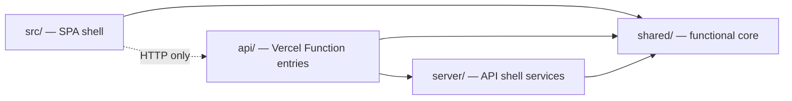
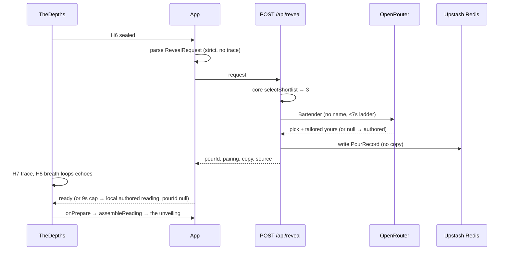
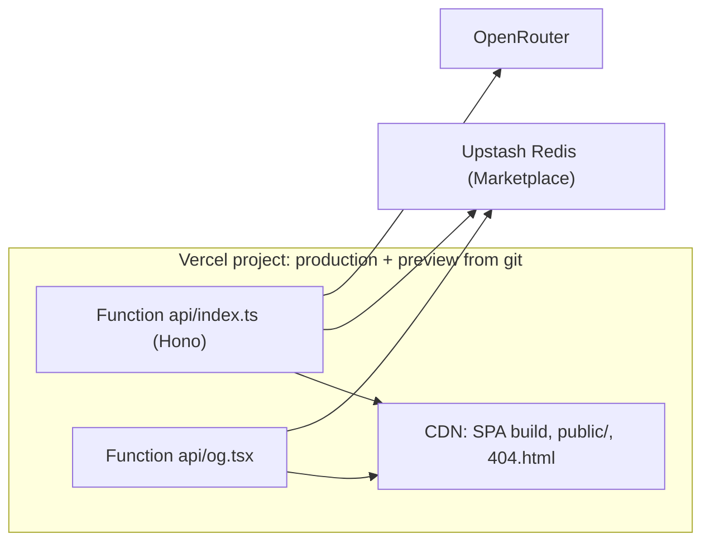

# Architecture Spine — Dionysus

## Design Paradigm

**Functional core, imperative shell.** A pure TypeScript core (`shared/`) holds every rule and all content: the answer types and schema, the option vocabularies, selection, the veto filter, the tailoring guard, reading assembly, pour and house-pour shapes, and the content data. Two shells import it:

- **SPA shell** (`src/`, browser): the journey, the reading, routing, audio, and the local fallback.
- **API shell** (`api/` + `server/`, Vercel Functions): the Bartender call, pour storage, rate limiting, share HTML and OG images.

The core has no DOM, no Node APIs, no network, no clock and no randomness. The same request produces the same shortlist and the same fallback reading in both shells.



Allowed imports: `src → shared`, `api → server, shared`, `server → shared`. Forbidden: `shared →` anything, `src → server|api`, `server|api → src`. The shells meet only over HTTP. ESLint `no-restricted-imports` plus separate tsconfigs enforce this (see Conventions).

## Invariants & Rules

### AD-1 — One canonical answer contract (v2)

- **Binds:** CAP-1; `shared/answers.ts`; every hold in `TheDepths`
- **Prevents:** the engine scoring fields the journey never writes (the 2026-09-18 blocker); two answer shapes or option lists drifting apart
- **Rule:** `Answers` = exactly the fields the journey writes (v2):
  - `name`, `lens`, `seed: SeedKey`
  - `gravity`: 5 keys, 0–100
  - `texture`: 9 binary keys → chosen word; an absent key means "hidden"
  - `drawnToward` (≤3), `soughtFor` (≤3), `flavors` (≤3)
  - `vessel`: one of 4 keys
  - `vetoes: Veto[]`
  - `trace`

  Every option list (lenses, seeds, gravities, binaries, words, flavours, vessels, vetoes) is declared once in the core, and `TheDepths` imports it. Retired quiz fields are deleted, not kept as optional. A new question means a new field here first.

### AD-2 — The trace never leaves the browser; neither does the name reach the LLM

- **Binds:** CAP-1, CAP-5; `POST /api/reveal`; the Bartender prompt; logs
- **Prevents:** "the one thing you told only the ink" reaching a server, an LLM provider or storage; a guest's identity reaching a model provider
- **Rule:** The wire request is `RevealRequest` = `Answers` minus `trace`, a `z.strictObject` at **every** nesting level, so unknown keys are rejected with 400. The client parses it with the same schema before sending. No server code, prompt, log line or record contains trace-derived text. `name` is sent (it's needed for the pour record) but it never goes into the prompt; the assembler adds it after the Bartender returns.

### AD-3 — Selection is deterministic up to the shortlist

- **Binds:** CAP-2; `shared/selection/`
- **Prevents:** client and server picking different personalities; the shortlist varying between runs
- **Rule:** `selectShortlist(req)`:
  1. Score the 12 archetypes with authored weight tables.
  2. Score all 132 pairings.
  3. Drop pairings with no authored cocktail or whose cocktail contains any of the guest's vetoes.
  4. Take the top 3, breaking ties by `pairingKey` ascending.

  The Bartender picks one of them. A non-shortlist answer means `shortlist[0]`. No RNG anywhere. Weight values and the pairing formula are tunable data, living only in the core.

### AD-4 — Vetoes steer the match; the pool can never be empty

- **Binds:** CAP-2, CAP-4; `shared/answers.ts`, the cocktail store, the H6 veto beat
- **Prevents:** serving a guest something they vetoed; an empty or short shortlist in either shell
- **Rule:** `Veto` is a closed enum: `egg-white | dairy | gluten | nuts | spice`. There is no "Alcohol" veto and no zero-proof variant at launch. Every authored cocktail declares `contains: Veto[]`; the field is required and may be empty. The store validator **always** requires at least 3 authored cocktails with an empty `contains`, so every veto combination still yields a full shortlist. At launch, `STRICT_STORE=1` also requires all 132 cocktails and at least 12 veto-free.

### AD-5 — One copy shape, one assembler

- **Binds:** CAP-5, CAP-7; owner reveal, pour page, house pours, fragment fallback, OG, print
- **Prevents:** surfaces building different views of one pour; the fallback differing between shells
- **Rule:** The reading has three blocks: `epigraph` and `whoYouAre` (authored, static per personality) and `yours` (authored base, the only block tailored live). `LiveCopy = {yours: string[]}`, which is the tailored passage only. The core exposes two functions, and every surface builds what it shows through them:
  - `selectShortlist(req)` (AD-3)
  - `assembleReading(pairing, copy | null, name, seed) → Reading`, where `copy: null` means the authored `yours` verbatim

  `Reading` = archetype identity + authored pour (cocktail, epigraph, whoYouAre, yours) + persona image geometry + name + seed + optional `LiveCopy`. The fallback is authored text, never text generated from answers. `CocktailResult` and `agentLines` retire.

### AD-6 — Live tailoring keeps the author's voice and never touches the recipe

- **Binds:** CAP-5; `server/bartender/`, `shared/reading.ts`
- **Prevents:** the LLM inventing meaning or facts; the live passage drifting from Robin's; copy that doesn't fit the reading layout
- **Rule:** The Bartender receives the trace-free, name-free answers plus up to 3 shortlist pours (essence, tagline, anchors, authored `yours`). It returns `{pick, yours: string[]}`, the picked pour's passage tailored by weaving in 2–3 of the guest's answers. It keeps the same anchors, images, order and paragraph count, and it may use no facts outside that pour's anchors. The response is requested as `response_format: json_schema` (strict) and zod-validated. The core guard `acceptTailoring(authored, tailored)` also requires the same paragraph count, total length within ±30% of the authored passage, and at least 50% of the authored content words kept. Any failure means `copy: null`, so the authored passage is served verbatim.

### AD-7 — The server is the only writer of pours; personal readings are never stored or served

- **Binds:** master spec §2; `POST /api/reveal`, storage, pour pages
- **Prevents:** clients injecting text into pages on our domain; a guest reading someone's private reading through a link or the API
- **Rule:** `POST /api/reveal` scores, calls the Bartender, writes the pour and returns `RevealResponse {pourId | null, pairing, copy: LiveCopy | null, source: 'bartender'|'authored'}`, all in one request.
  - `PourRecord` v1 = `{v:1, id, pairing, name, seed: SeedKey, source, createdAt}` (`source` ∈ `'bartender'|'authored'`).
  - A guest's reading is shown to its owner in-session only.
  - A guest pour opened by link always renders the gift view, with the reading withheld.
  - No endpoint accepts client-written pour content.

### AD-8 — Pour ids and house pours

- **Binds:** storage, `/pour/:id`, the Entrance side door, the velvet rope
- **Prevents:** guessable links; a house pour's id colliding with a guest's; the side door showing nothing of the payoff
- **Rule:** Guest pour ids use nanoid over `[0-9a-z]`, length 10.
  - House pours are core constants `{id: 'house-<slug>', pairing, motive, epigraph, whoYouAre, yours}`. Their authored text overrides the pairing's. The `-` makes their ids unreachable by the nanoid alphabet.
  - Their authored reading is about the act of taking the side door: the Trickster who thought they'd be sneaky, the Impatient, the Cautious, and so on.
  - House pours render the **owner view**, reading shown.
  - The SPA picks one from the side-door interaction, with no server call and nothing persisted. `/pour/house-*` resolves the same constants.

### AD-9 — Reveal orchestration and the silent fallback

- **Binds:** master spec §4; `App`, `TheDepths` H6/H8
- **Prevents:** two components firing or awaiting the reveal; the reveal stalling on the LLM; a visible error
- **Rule:**
  - `App` alone owns the reveal request. It fires the moment H6 seals and holds the promise.
  - H8's ENGINE SEAM is the wait: the breath loops its echoes until `App` reports ready, or until a hard cap of 9s after the request was sent, then condenses.
  - The server answers within 8s: LLM ladder ≤7s, rate-limit timeout 500ms, and serves the authored passage on failure.
  - Any non-200, network error, response-schema mismatch (deploy skew) or the cap firing gives the local `assembleReading(pairing, null, …)` result (the shortlist's top pour with its authored passage) and `pourId: null`. There is no retry and nothing is shown to the user.

### AD-10 — Two share forms only

- **Binds:** keepsake "Share", routing
- **Prevents:** a third share format; old full-result fragments
- **Rule:** A pour with an id shares `/pour/:id`. A pour without one shares `/#pour=` carrying `{pairing, name, seed}` (gzip + base64url). It is parsed with the `PourRecord`-minus-id schema; an unknown pairing counts as a broken link. It renders the gift view through `assembleReading`.

### AD-11 — Content ownership by permanent pairing key

- **Binds:** CAP-4, CAP-6; `shared/data/`
- **Prevents:** three files keying a personality three ways; two owners of one field; old links dying
- **Rule:** One `pairingKey(primary, secondary)` returns a lowercase `primary-secondary` slug with spaces turned into dashes (`magician-outlaw`, `regular-guy-sage`). Key values are **permanent**: never renamed or removed. Pours are pointers, so editing an authored cocktail deliberately updates every existing link.

  | Dataset | Owns |
  | --- | --- |
  | `archetypes` | identity: name, essence, story (source material, not rendered), goal, fear |
  | `pours` (authored, one per pairing) | cocktail: name, tagline, glassware, recipe `{amount,item,note?}`, method, `closingLine`, `contains`. Meaning: `anchors[]` (≥3, `{kind, fact, meaning, speaksTo?}`, `kind` an open string: lineage, riff, ingredient, gesture, glass…; never rendered directly). Reading: `epigraph`, `whoYouAre`, `yours[]` |
  | `personas` | image geometry (`glass`, `tag`, `wide`, `wideTag`) |

  A pairing with no image uses `_fallback.jpg`. The meaning model is specified in `../design-artifacts/2026-09-23-cocktail-meaning-model.md`. The v1 procedural generation (`cocktails.ts` SPIRITS / `mixology.ts` `craftCocktail`) retires.

### AD-12 — LLM access: one provider, a config ladder, privacy flags

- **Binds:** `server/bartender/`
- **Prevents:** provider SDKs spreading through the code; paid calls by accident; guest data used for model training
- **Rule:** Only OpenRouter chat completions, over plain `fetch`.
  - `BARTENDER_MODELS` is an ordered list: `:free` models that list `structured_outputs` first, and an optional `anthropic/claude-haiku-4.5` last. The ladder stops when the 7s budget runs out.
  - Every request carries `provider: {data_collection: 'deny', require_parameters: true}`.
  - The account's free-model training toggle is off. The key lives only in server env vars and has a credit limit set before the paid rung is enabled.

### AD-13 — Share pages are server-rendered HTML for crawlers

- **Binds:** master spec §2 OG; `api/`, `vercel.json`
- **Prevents:** shared links unfurling as a generic SPA shell; server-built HTML becoming an injection surface; the OG function hitting its size cap
- **Rule:**
  - `GET /pour/:id` (served by the Hono function on its original path) fetches `/index.html` from the request origin and injects HTML-escaped `og:*` meta. `og:image` is the absolute URL `/api/og/:id`.
  - A dead id returns HTTP 404 with the SPA shell, which renders the poetic 404.
  - Share HTML never inlines pour data.
  - `api/og.tsx` imports only the narrow `shared/og.ts` (pairing → image path, portrait `tag` geometry, cocktail name). It composes the escaped name onto the 3:4 portrait master.

### AD-14 — One pour read path and a four-outcome client router

- **Binds:** `server/pours`, `GET /api/pours/:id`, `src` routing
- **Prevents:** SPA and API disagreeing on how a pour is found or how a dead id is signalled
- **Rule:**
  - `getPour(id)` (house constants first, then Redis) is the only lookup. It backs `GET /api/pours/:id` → `200 PourRecord | 404 {error:{code:'pour_not_found'}}` and the share HTML.
  - The SPA location parser has exactly four outcomes:
    - `landing` for `/`
    - `pour(id)` for `/pour/:id`, where the id matches `^[0-9a-z]{10}$|^house-[a-z-]+$`
    - `fragment` for `#pour=`
    - `notfound` for everything else
  - A malformed id goes to `notfound` without a fetch. Any non-200 renders the poetic 404.

## Consistency Conventions

| Concern | Convention |
| --- | --- |
| Pairing identity | Always a `PairingKey` from `pairingKey()`; never raw primary/secondary or a display name as a key |
| Wire format | JSON; camelCase; ISO-8601 UTC timestamps; `{error:{code,message}}` envelope; every request and response schema is zod in the core, `z.strictObject` at every level |
| Input bounds | `name`: trimmed, 1–40 chars (a pour record allows `''`), no control characters, and the only free text on the wire. Every other field is an enum or enum array. `seed` is a `SeedKey`; hex and display name are looked up in the core |
| Output escaping | Every value interpolated into server HTML or the OG image is escaped; the SPA relies on React escaping only (no `dangerouslySetInnerHTML` with pour data) |
| Versioning / skew | Records carry `v`; readers handle every `v` ever written. SPA↔API skew means a 400, which the client handles as a silent fallback, and it is logged |
| Errors | The API never returns raw errors; the SPA never shows an error string (in-world lines or silent fallback only) |
| Logging | One structured line per reveal on **every** path: `{pairing, source, failReason, model, ms}`. No answers, no name, no trace |
| Ops check | A weekly look at the `authored` (fallback) ratio in logs is the LLM-outage alarm (the silent fallback hides outages). The one-time $10 OpenRouter top-up raises the free tier to 1,000 requests/day |
| Config | Server-only env vars: `OPENROUTER_API_KEY`, `BARTENDER_MODELS`, `KV_REST_API_URL`/`KV_REST_API_TOKEN` (Marketplace; `UPSTASH_REDIS_REST_*` accepted). No secret ever goes in `VITE_*` |
| Degradation | Env vars are checked before a client is built. No OpenRouter key means authored passages verbatim. No or failing Redis means `pourId: null` (writes in try/catch). No image means `_fallback.jpg`. Nothing crashes on a missing integration |
| Rate limit | `@upstash/ratelimit` sliding window of 10/min per IP (`ipAddress()` from `@vercel/functions`); `timeout: 500`; `pending` passed to `waitUntil`; over the limit returns 429, which the client handles as a local fallback. IPs exist only in keys that expire with the window |
| Storage keys | `<VERCEL_ENV>:pour:<id>` and `<VERCEL_ENV>:rl:` (rate limit), so preview never touches production data; pours have no TTL |
| Deploy | Vercel project root = `Dionysus/Cocktail_Website_Agent/dionysus-experience`. `vercel.json` has `"framework": "vite"` and ordered rewrites: `/pour/:id → /api`, `/api/og/:id → /api/og?id=:id`, `/api/:path* → /api`, with **no** `/(.*)` catch-all. The build copies `index.html` to `404.html`. Never create `app|index|server.ts` at the root or in `src/` (that triggers zero-config Hono) |
| Types & boundaries | Three tsconfigs: app (`src` + `shared`, DOM), api (`api` + `server` + `shared`, Node, `jsx: react-jsx`), node (tooling). `shared` gets ES lib only. `build` runs `tsc -b` over all. Imports are extensionless and relative |
| Tests | vitest over the core: selection determinism, veto filter + pool floor, `pairingKey`, `acceptTailoring`, `assembleReading`, nested-strict rejection, the store validator, and a contract test that builds `RevealRequest`s with the same helper the SPA uses. One Playwright smoke: `/pour/house-trickster` renders, a dead id gives the 404 |
| Content gate | The validator runs in `build`. A pour counts as authored only when it has a complete cocktail (incl. `closingLine`, `contains`), ≥3 anchors, `epigraph`, `whoYouAre` and `yours`. It always enforces the AD-4 floor (≥3 veto-free); `STRICT_STORE=1` (launch) enforces all 132. Unauthored pairings are excluded from selection until written |
| Privacy | No trace server-side; no name to the LLM; provider data-collection denied; names are stored with pours (kept forever); one quiet in-world privacy line near Share (copy written during build); deletion on request is done by hand |
| Audio | A single `src/audio` director owns all playback. Assets in `public/audio` are prefetched on idle and unlocked + played on the Entrance CTA gesture, so the click is the first sound. Audio never gates a phase or video transition and fails silently. Still Water keeps the bed and drops transients |

## Stack

| Name | Version |
| --- | --- |
| React | ^19.2 (latest 19.3.0) |
| Vite | ^8.0 (latest 8.3.0) |
| TypeScript | ~6.0 |
| Tailwind CSS | ^4.3 |
| Node.js (Vercel Functions) | 22+ |
| hono | ^4.13.8 |
| zod | ^4.6.5 |
| @vercel/og | ^1.0.3 |
| @vercel/functions | ^3.9.9 |
| @upstash/redis | ^1.39.0 |
| @upstash/ratelimit | ^2.1.0 |
| nanoid | ^6.0.1 |
| vitest | ^5.0.1 |
| Playwright | ^1.60 (already a devDependency) |
| Hosting | Vercel (one project; Upstash Redis via Vercel Marketplace) |
| LLM gateway | OpenRouter (`:free` models with `structured_outputs`; optional `anthropic/claude-haiku-4.5`) |

## Structural Seed

```text
dionysus-experience/
  shared/                 # functional core — pure TS, ES lib only
    answers.ts            # Answers v2, option vocabularies, Veto, SeedKey, RevealRequest (strict zod)
    pairing.ts            # PairingKey, pairingKey()
    selection/            # weights, scoring, veto filter, selectShortlist()
    reading.ts            # LiveCopy, Reading, acceptTailoring(), assembleReading()
    pour.ts               # PourRecord, RevealResponse (zod), house pours
    og.ts                 # narrow OG data: pairing → image, portrait tag, cocktail name
    data/                 # archetypes.ts, pours/ (authored store), personas.ts
    validate.ts           # store validator (vitest + build)
  src/                    # SPA shell — journey, reading, routing, audio/, api client, pourLink
  server/                 # API shell — bartender/ (prompt, ladder, parse), pours (getPour, write), ratelimit
  api/
    index.ts              # the Hono app: POST /api/reveal, GET /api/pours/:id, GET /pour/:id
    og.tsx                # @vercel/og image, ?id=
  public/personas/        # 132 persona images (3:4, ~260KB JPEG) + _fallback.jpg
  public/audio/
  vercel.json
```





Local development runs `vercel dev`, so the SPA and `api/` run together (run `vercel build` once before the first deploy). Without keys, the app serves the authored passages verbatim.

## Brownfield Delta

The front-end edits the ADs require, so no story under-scopes them:

| AD | Today | Change |
| --- | --- | --- |
| AD-1 | `TheDepths.tsx:957` writes `color/colorName/colorTouched` | Write `seed: SeedKey` |
| AD-1 | `:1474` writes `drinkScales` | Write `vessel` |
| AD-1/4 | `:1487` writes `allergies` string; `:215` lists `'Alcohol'` | `vetoes: Veto[]`; drop Alcohol; labels from the core |
| AD-1 | `insight` (`:1514`, `types.ts:29`) | Rename to `trace`; H8 echoes (`:445,459`) read v2 fields |
| AD-1 | Option lists declared in `TheDepths` | Import from `shared/answers.ts` |
| AD-5 | `TheReading` takes `CocktailResult`; share strips fields (`:217-228`) | Prop becomes `Reading`; share per AD-10 |
| AD-9 | `App.tsx:245,259` call `craftCocktail`; ENGINE SEAM comment `TheDepths.tsx:1677` | App owns the request; the breath waits on it; DEV sample becomes a `Reading` fixture |
| AD-10 | `pourLink.ts` carries the full `CocktailResult` | `{pairing, name, seed}` |
| AD-8 | `VelvetRope.tsx:26` fragment + `CONNOISSEUR_SAMPLE`; no side door yet | House pours via `/pour/house-*` and the side door |
| AD-14 | `App.tsx:48` treats every non-`/` path as 404 | Four-outcome parser |
| AD-11 | `data/cocktails.ts`, `engine/mixology.ts` | Retire; content moves to `shared/data/` |
| AD-5 | `TheReading` renders epigraph + reading lines; The Ritual has no closing line | Render epigraph, whoYouAre, yours; The Ritual ends on `closingLine` |
| Deploy | `vercel.json` `/(.*)` catch-all | Ordered rewrites per Conventions |

## Capability → Architecture Map

| Capability / Area | Lives in | Governed by |
| --- | --- | --- |
| CAP-1 intake | `TheDepths` → `shared/answers.ts` | AD-1, AD-2 |
| CAP-2 hybrid selection | `shared/selection/` + `server/bartender/` | AD-3, AD-4, AD-12 |
| CAP-3/4 Tier A authoring | `shared/data/pours/` (Robin + authoring agents, offline) | AD-4, AD-11, content gate |
| CAP-5 Bartender tailoring | `server/bartender/`, `shared/reading.ts` | AD-2, AD-5, AD-6, AD-9 |
| CAP-6 two tiers | core data vs API runtime | paradigm, AD-11 |
| CAP-7 one payload | `RevealResponse` + `assembleReading` | AD-5, AD-7 |
| Sharing + OG | `api/`, `server/pours`, `src` pourLink | AD-7, AD-10, AD-13, AD-14 |
| House pours / side door | `shared/pour.ts`, `src` | AD-8 |
| Routing | `src` parser, `vercel.json` | AD-14, Deploy convention |
| Resilience + ops | both shells | AD-9, Degradation, Logging, Ops check |

## Deferred

- **Weight-table values and the pairing formula.** Tunable core data, calibrated during build. The old fixtures are archived because they use the old questionnaire, so calibration uses fresh runs of the new journey.
- **How house pours are chosen from the side-door interaction** (timing, hover, and so on) and how many there are. Build/UX, inside AD-8.
- **Zero-proof variants.** Post-launch, if guests feel left out; that would add a `Veto` value and an optional recipe variant.
- **Per-hold funnel analytics.** v1 is pour `createdAt` (reveals requested) plus Vercel Web Analytics page views.
- **Pour deletion on request.** Handled by hand in the Upstash console.
- **OG card visual design and font; Bartender prompt wording; the privacy line's copy.** Build-phase craft inside AD-6 / AD-13.
- **Sound design.** Build phase, inside the Audio convention.
- **Share pages on protected preview deployments.** Crawlers can't unfurl them; production only.
- **Non-English, accounts, runtime image generation.** Out of v1 (SPEC non-goals).
