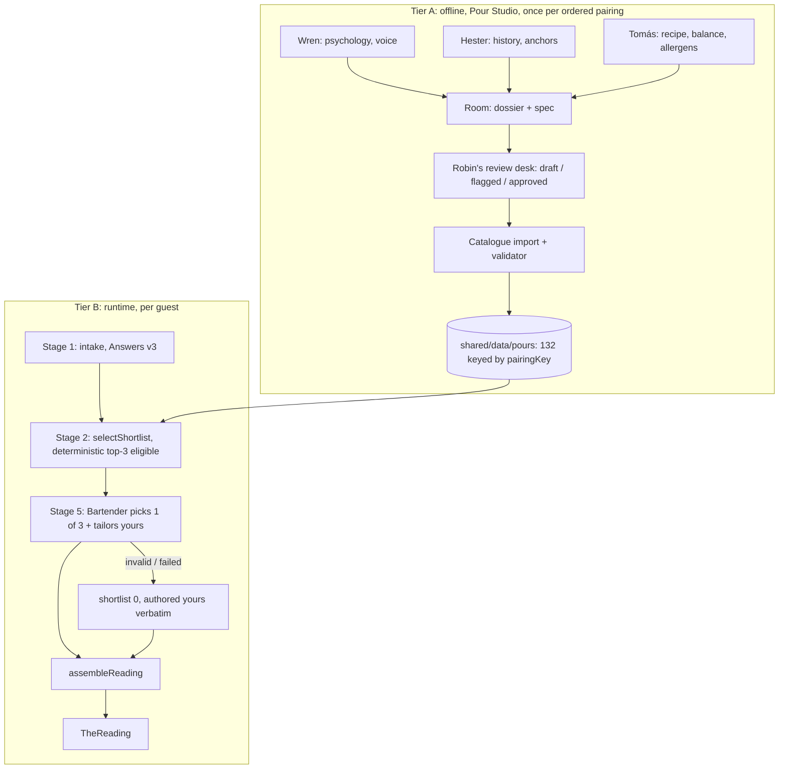

# Pipeline stages: two tiers, five stages

Refreshed 2026-10-06 from `../ARCHITECTURE-SPINE.md` and later decisions. Runtime wiring is the spine's (AD-3, AD-5, AD-6, AD-9). This file fixes each stage's input, output and boundary.

## Stage 1 · Intake (CAP-1, Tier B)

- **In:** the guest's choices across H0–H7.
- **Out:** `Answers` v3 plus browser-only `IntakeDiagnostics` and `trace` (intake-contract.md).
- **Boundary:** only `Answers` leaves the browser.

## Stage 2 · Selection (CAP-2, CAP-8, Tier B)

- **In:** `Answers` (no trace) and the catalogue.
- **Out:** 3 eligible pairingKeys, ranked.
- **Rules:** matching-model.md and AD-3/AD-4. Pure core, identical in both shells.

## Stage 3 · History (CAP-3, Tier A)

- **Owner:** Hester.
- **Out:** sourced anchors `{kind, fact, meaning, speaksTo?}`, at least 3 per pour, plus fact cards.
- **Boundary:** facts, not copied wording. Moral and cultural context is handled respectfully. Never sets the recipe.

## Stage 4 · Recipe (CAP-4, Tier A)

- **Owner:** Tomás.
- **Out:** one canonical recipe per ordered pairing: spec JSON and dossier table, method, `closingLine`, `contains`. Balance and allergen checks are run with the dps-tools.
- **Boundary:** the runtime never changes it. Each pour has a fixed glass.

## Stage 5 · Bartender (CAP-5, Tier B)

- **In:** the trace-free, name-free answers, and the 3 shortlisted pours (essence, tagline, anchors, authored `yours`).
- **Out:** `{pick, yours[]}`.
- **Guard and fallback:** AD-6.
- **Never:** recipes, new facts, the guest's name, the trace.

## Evaluation fixtures

- `../matching/fixtures-v1.json` holds one valid v3 answer set per pairing that makes it lead the fallback. The core's coverage tests use them.
- Persona-feel review uses fresh playtest runs of the live journey.
- The old-questionnaire docx fixtures are archived (`../_archive/2026-09-23-superseded/`) and must not be used.
