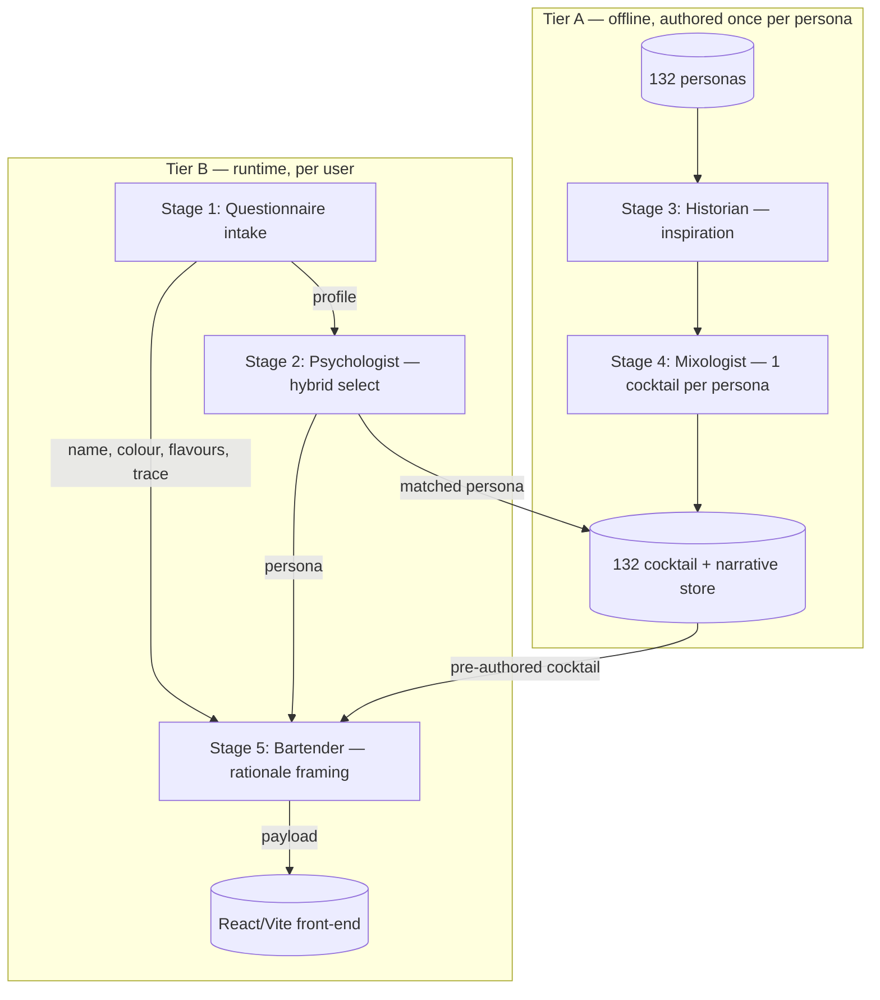

# Pipeline Stages — Agent I/O Contract

The five stages across two locked tiers. Each names its **input**, **output**, and the **source data** it must read. Runtime wiring (orchestrator, sync/async, n8n vs in-app) is an architecture decision, not fixed here.

## Two-tier data flow (locked)

## Stage 1 — Questionnaire intake · Tier B (CAP-1)

- **Input:** user responses to the New Revamped Questionnaire.
- **Output:** a normalized `profile` object. Fields:
  - `name` (text)
  - `capture_frame` — Real me / Dream alter ego / Night version / Inner child / Future self / Fictional persona
  - `colour` (from colour scale) — also the favourite colour used for image personalization
  - `gravity` — 5 axes: Solitary↔Social, Controlled↔Wild, Classic↔Experimental, Analytical↔Instinctive, Grounded↔Dreamlike
  - `drivers` — up to 3 of: Freedom, Beauty, Mastery, Pleasure, Recognition, Peace, Knowledge, Belonging, Power, Change, Wonder, Mischief *(map onto archetype drivers — see personality-model.md)*
  - `come_to_you_for` — up to 3 of: Advice, Energy, Protection, Honesty, Ideas, Comfort, Courage, Taste, Perspective, Fun, Leadership, Calm, A reality check, A little chaos
  - `inner_texture` — 9 binary picks: Sharp/Smooth, Relaxed/Excited, Positive/Negative, In-control/Out-of-control, Quiet/Loud, Risk-averse/Risk-taker, Bright/Dark, Soft/Rough, Harmonic/Disharmonic
  - `flavours` — any of: Sweet, Bitter, Spicy, Herbal, Fruity, Citrusy, Fresh, Floreal, Smoky *(framing + secondary selection signal only — does not change the fixed recipe)*
  - `vessel` — Short & strong / Poised & ceremonial / Tall & cold / Light & sparkling *(framing + secondary signal)*
  - `craft_level` — scale: curious stranger → old friend
  - `trace` — free text ("leave one trace of yourself")
- **Removed:** the exclusions/allergens question ("what should never touch your glass") — dropped because a serve-only runtime cannot honor it without deceiving the user.
- **Canonical source:** `../data/New Revamped Questionnaire.docx` (the exclusions question is to be removed from it).

## Stage 2 — Psychologist / Personality agent · Tier B (CAP-2)

- **Input:** `profile`.
- **Reads:** `../data/Brand Personality + Roulette.xlsx` (both sheets) — see personality-model.md.
- **Mechanism (hybrid):** deterministic scoring of answers → shortlist of close-fitting personas → LLM makes the final pick and writes the rationale.
- **Output:** `chosen_personality` = { archetype, persona_name, persona_attributes } + `rationale` (concise, cites specific answers, written to make the user feel seen). Two candidates may be reasoned internally; only the chosen one is contract output.

## Stage 3 — Historian agent · Tier A offline (CAP-3)

- **Input:** a persona (one of the 132).
- **Output:** `inspiration` = { cocktails[]: {name, origin, story, persona_link}, ingredients[]: {name, story, persona_link} }. Cocktails and ingredients need not correspond. Includes moral/cultural context where relevant, handled respectfully.
- **Boundary:** inspiration and wisdom only — does **not** create the final cocktail.
- **Reference corpus:** the custom knowledge base (`../../Knowledge base/cocktail_counsel_knowledge_base.md`), historical/mixology knowledge (e.g. Wondrich's *Imbibe!*), and the real inventory below for what is buildable.

## Stage 4 — Mixologist agent · Tier A offline (CAP-4)

- **Input:** `inspiration` + the persona's traits.
- **Designs for:** symbolic + emotional fit and mixological coherence, drawing on the KB ingredient-symbolism library. Not bound to a fixed inventory (the v1 home-bar constraint is dropped).
- **Output:** `cocktail` = { ingredients[]: {name, quantity}, method[] }. One canonical cocktail per persona, written into the 132-store.

## Stage 5 — Bartender agent · Tier B (CAP-5)

- **Input:** `chosen_personality`, the matched pre-authored `cocktail` + its `inspiration` (symbolism), and `profile` (name, colour, flavours, trace).
- **Reads:** the custom knowledge base (`../../Knowledge base/cocktail_counsel_knowledge_base.md`) for Product concept, Experience principles, brand voice, and symbolism libraries.
- **Output:** the rationale (#6) + emotional fit (#2) of the payload in `output-contract.md`; the recipe and the other elements are served as pre-authored. The prompt lives at `../prompts/bartender.md`.
- **Possible orchestrator role** — to be decided in architecture.

## Evaluation fixtures

Real filled questionnaires usable as gold inputs to judge Stage 2 / Stage 5 quality (note: **older** questionnaire format — migrate or map before use): `../data/fixtures/Florence Boudot.docx`, `../data/fixtures/Margot Houdoux.docx`, `../data/fixtures/Nicolas Gavrilenko.docx`, `../data/fixtures/Andreas Mastorakos.docx`, `../data/fixtures/Helene Guibert.docx`, `../data/fixtures/Cyriaque Houdoux.docx`, `../data/fixtures/Pauline Pic-Paris.pdf`, `../data/fixtures/Clara.docx`, `../data/fixtures/Pierre Cloarec.docx`, `../data/fixtures/Julien.docx`, `../data/fixtures/Chaker Bejaoui.docx`.
