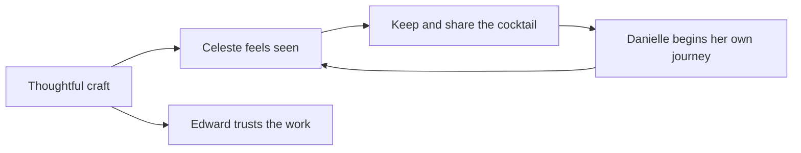

# Trigger Map: Dionysus

Created 11 June 2026 · Refreshed 8 October 2026

The guest's emotional connection drives portfolio value. Preserve the psychology while using the current Suspended Pour experience, authored catalogue and private owner reading.

| Person | Wants | Fears | Product response |
| --- | --- | --- | --- |
| [Celeste](02-celeste-the-curious.md) | Discovery, feeling seen, a drink worth keeping | Generic labels, clinical forms, empty AI prose | Clear atmospheric interactions, meaningful authored pours, personal reading and clean print |
| [Edward](03-edward-the-evaluator.md) | Evidence of creative engineering | Jank, weak mobile behavior, invented facts and shallow wrappers | Coherent motion, Still Water, auditable selection, fixed recipes and bounded tailoring |
| Danielle, the shared recipient | Admire a friend's cocktail and try her own | Quiz spam or a disappointing destination | Beautiful recipe gift and a clear invitation, with the private reading withheld |

## Strategic documents

- [Business goals](01-business-goals.md): desired outcomes and honest measures.
- [Key insights](05-Key-Insights.md): the implications for design and development.
- [Feature impact](feature-impact-analysis.md): current priorities and delivery boundaries.
- [UX scenarios](../C-UX-Scenarios/00-ux-scenarios.md): how the needs become journeys.

The original >80% completion and >40% save targets are aspirations, not results. Historical ink-marbling, nineteen-question and per-visit multi-agent generation details are superseded by the [current experience contract](../2026-07-08-experience-master-spec.md).
