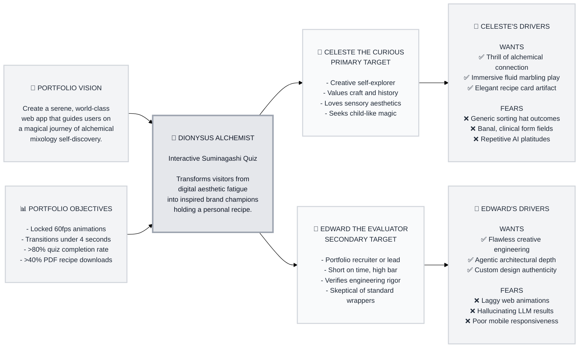

> Historical copy preserved on 8 October 2026. Current experience: [master specification](../../../2026-07-08-experience-master-spec.md).

# Trigger Map: Dionysus

> Connect business goals to user psychology — understand why people act, not just what they do.

**Created:** 2026-06-11
**Phase:** 2 — Trigger Mapping
**Agent:** Saga (Analyst)

---

## Documents

The following documents constitute the strategic foundation for Dionysus's user psychology and feature prioritization:

| # | Document | Purpose | Status |
|---|----------|---------|--------|
| 01 | [Business Goals](01-business-goals.md) | Vision, objectives, and metrics | COMPLETE |
| 02 | [Celeste the Curious](02-celeste-the-curious.md) | Primary Persona: Self-Explorer | COMPLETE |
| 03 | [Edward the Evaluator](03-edward-the-evaluator.md) | Secondary Persona: Portfolio Reviewer | COMPLETE |
| 05 | [Key Insights](05-Key-Insights.md) | Strategic design & dev implications | COMPLETE |
| — | [Feature Impact Analysis](feature-impact-analysis.md) | Forces × features scoring | COMPLETE |

---

## Trigger Map Visualization

---

_Created using Whiteport Design Studio (WDS) methodology_
