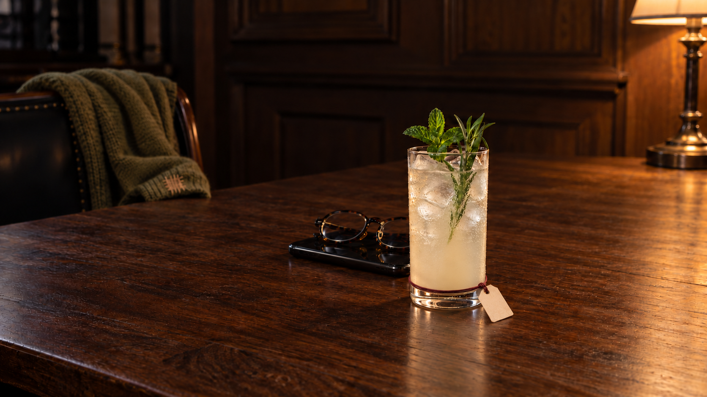

# Further Than Me — lower attachment and personality correction

7 October, user-directed. Two built-in edits preserved: first replaces prominent mid-body loop with low transition loop and adds a repaired olive cardigan; sole focused follow-up lowers band again towards clear foot. Actual original1672×941v4 inspected, measured, source/spec unchanged. v2/v3 remain untouched. Current canonical candidatev4, correctionaddsno pairingcount. No generated text.

The Mentor is restrained but not a minimalist persona: they listen without handing down answers, then feel proud and privately left behind when calls stop. Phone is explicit; spectacles and darned cardigan are ordinary inferred traces, not Brian Rea/Jerry Berns possessions. Three traces rather than more recipe ingredients. Cardigan currently lies far left and is lost by proposed portrait; its wide-only contribution is not phone acceptance.

Tag now rests beside the clear glass foot with a much lower exterior cord/front arc, small knot and short downward tether through punched paper. Lower paper contacts timber with shadow; not a stuck-on label. The arc is at the upper clear-foot transition, not confidently entirely beneath every projection of pale liquid. Far-side closure/friction/knotload remain unproved. Writable axis68px, names untested. Glossy amber wood and dense glass/ice remain material holds.

[Actual first correction prompt](sage-caregiver/v3/prompt.md) · [actual height-edit prompt](sage-caregiver/v4/prompt.md) · [measurements](sage-caregiver/v4/measurements.json) · [root review](sage-caregiver/v4/root-master-review.md) · [provenance](sage-caregiver/v4/provenance.json)

No JPEG export/retry/bypass, public/runtime change, browserrequest or acceptance. Browser deferred/heartbeatPAUSED. Final export permission remains unresolved for this corrected version.
