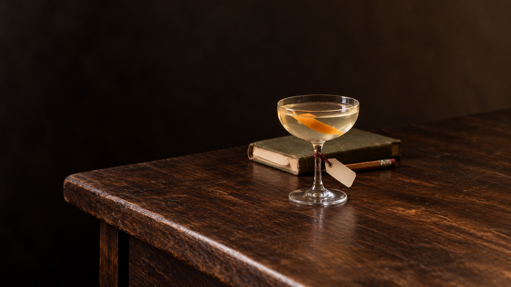
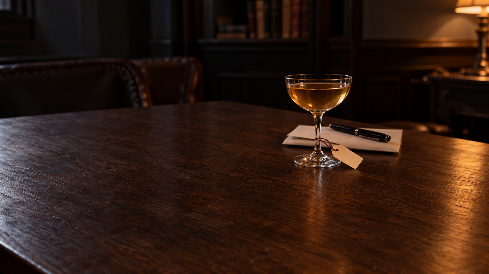
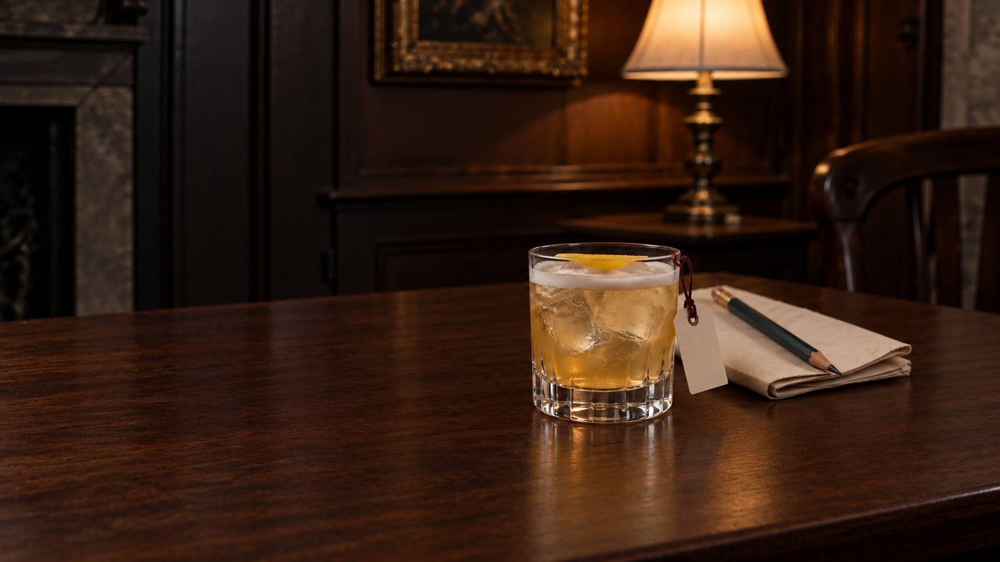
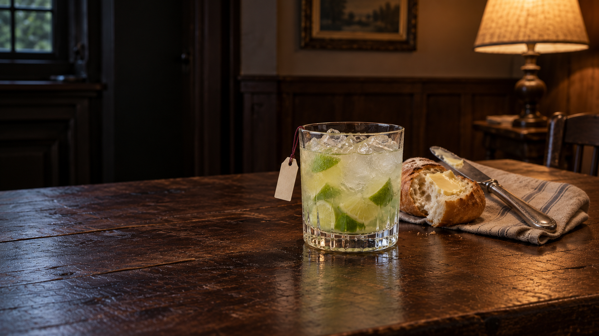
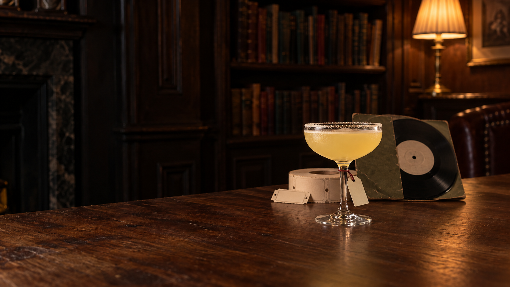
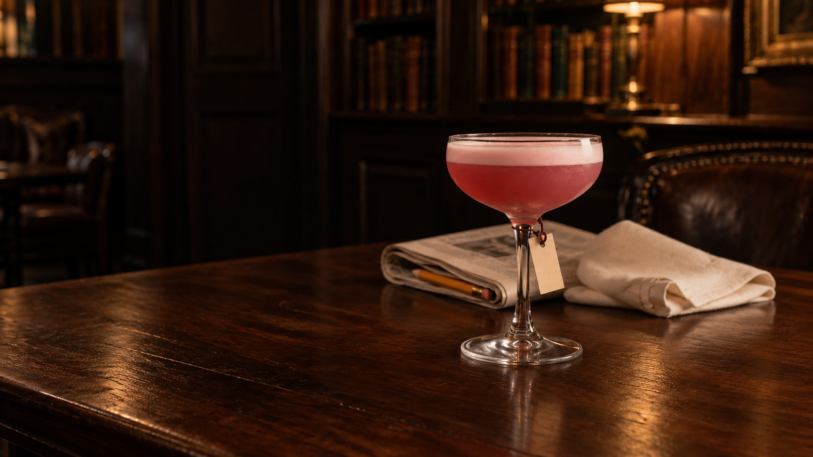

# Production batch07 — measured image drafts

2026-10-07. Seven new pour scenes after the two user-requested small-tag corrections. Each initial and sole targeted correction is preserved. Root inspected every selected original1672×941 PNG; current dossier/spec and original/master copies, actual dimensions and measured extents independently verified7/7. These are review drafts, not final wide/portrait JPEG pairs.

[Smaller Go On and Whoever Comes In tags](tag-scale-corrections-v3.md) are saved separately as v3; no new pairing count. The user-scale rule now keeps paper discreet, separate and proportional rather than inflating it for an old numeric writing goal. Actual names remain untested.

Current collection:70 generated candidate pairings,27 exported pairs,43 measured/unexported masters,45 ungenerated. All17 public pairs preserved; zero newly accepted/integrated.115 final pairs still missing. Browser checks user-deferred; producer heartbeat PAUSED. No JPEG exporter invocation, rejected retry/bypass, new READY request, public/runtime/source/editorial changes, publishing or deployment. Earlier unanswered scoped export question does not cover this batch or current tag corrections.

Required eventual exports1920×1080 wide and896×1200 portrait remain outstanding. Proposed702px crops are not phone/breathing acceptance; some clip traces. Small tags require actual font/glyph fitting later without enlarging the paper. Glass/material/personality/appearance holds remain separate from hash/geometry evidence.

[Manifest](production-batch-07.json) · [Master audit](production-batch-07-master-audit.json)

## Nothing Escaped You

Almost colourless pale-straw still coupe, orange strip INSIDE, no serving ice/foam/rim; source pisco/verjus stirring melt preserved, not added water. Worked notebook and separate short pencil infer modest study/answering questions, not literal biography or magical crystals.363px glass/full511px group still too wide for moving phone;702px proposed portrait retains scene.103px paper smaller than273px bowl,70px usable face measured—not enlarged for old heuristic; names untested. Pencil tip partly occluded but substantial body+eraser recognizable. Dense glossy distressed timber/uniformly worn cover remain material hold and generic specificity watch.

Actual1672×941; glass363px; full group511px, essential-recognition510px; actual clean tag axis70px. These measurements do not imply recipe, personality, name or phone acceptance.

[Measurements](sage-innocent/v2/measurements.json) · [Root review](sage-innocent/v2/root-master-review.md) · [Owner review](sage-innocent/v2/review.md) · [Prompt](sage-innocent/v2/prompt.md) · [Readiness](sage-innocent/v2/readiness.md) · [Provenance](sage-innocent/v2/provenance.json) · [Initial prompt](sage-innocent/v1/prompt.md)

## Against My Better Judgement

Clear pale amber stemmed stirred drink, no serving ice/foam/garnish; lemon oil only, peel removed as specified. Letter from whoYouAre and whole capped pen reply-habit inference are recognisable, no pseudo-writing.323px glass/full412px group near but wider than estimated389px maxbreathing phone.110px proportional paper,78px clean face, lower corner near tabletop; name/suspension unverified. Plain clean bowl improves; glossy raised wood and cooler-left/warm-right reflections held. Specificity of hidden hope/joke remains watch.

Actual1672×941; glass323px; full group412px, essential-recognition412px; actual clean tag axis78px. These measurements do not imply recipe, personality, name or phone acceptance.

[Measurements](jester-sage/v2/measurements.json) · [Root review](jester-sage/v2/root-master-review.md) · [Owner review](jester-sage/v2/master-review.md) · [Prompt](jester-sage/v2/prompt.txt) · [Readiness](jester-sage/v2/readiness.md) · [Provenance](jester-sage/v2/provenance.json) · [Initial prompt](jester-sage/v1/prompt.txt)

## Where You Stand

Root inspected actual1672×941 PNG at original resolution. Clear amber still coupe and single orange peel inside read coherently; no ice/foam/rim. Small65px paper versus217px bowl hangs beside stem with hole/cord and air gap;60px axis at70degrees, name fit untested. Whole useful keys and recognisable phone body/receiver are plausible practical-help/open-door habit inferences, not literal possessions or sufficient moral-code evidence. Phone partly occluded but entire visible body/receiver recognisable, no anonymous sliver.306px glass; essential440px/including lead493px spread remains beyond moving-phone window;702portrait preserves visible group only, not browser PASS. Warm broad glossy timber/fine-pattern hold, telephone competes with drink. Functional keys allowed. No pixels establish vessel capacity. Initial + sole correction exhausted; no exports/acceptance/integration.

Actual1672×941; glass306px; full group493px, essential-recognition440px; actual clean tag axis60px. These measurements do not imply recipe, personality, name or phone acceptance.

[Measurements](outlaw-regular-guy/v2/measurements.json) · [Root review](outlaw-regular-guy/v2/root-master-review.md) · [Owner review](outlaw-regular-guy/v2/master-review.md) · [Prompt](outlaw-regular-guy/v2/prompt.txt) · [Readiness](outlaw-regular-guy/v2/readiness.md) · [Provenance](outlaw-regular-guy/v2/provenance.json) · [Initial prompt](outlaw-regular-guy/v1/prompt.txt)

## Hear Me Out

Amaretto/bourbon sour over fresh cubes, thin white foam and ONE yellow lemon strip broadly flat on top, no cherry. Body remains too clear/golden for source cloudy pale gold-amber, physical-appearance hold. Discussion page blank reverse and whole worn pencil infer argument-testing rather than magic manifesto.306px glass fits height intent;644px full/642px recognition spread still too wide for moving phone,702px portrait only. Small tied88px paper and105px long face proportional; real names untested. Dense crystalline ice and glossy patterned orange-amber wood held, generic paper/pencil specificity watch.

Actual1672×941; glass306px; full group644px, essential-recognition642px; actual clean tag axis105px. These measurements do not imply recipe, personality, name or phone acceptance.

[Measurements](outlaw-sage/v2/measurements.json) · [Root review](outlaw-sage/v2/root-master-review.md) · [Owner review](outlaw-sage/v2/private-review.md) · [Prompt](outlaw-sage/v2/prompt.txt) · [Readiness](outlaw-sage/v2/readiness.md) · [Provenance](outlaw-sage/v2/provenance.json) · [Initial prompt](outlaw-sage/v1/prompt.txt)

## Good as It Is

Root inspected actual1672×941 PNG at original resolution. Pale faintly cloudy lime caipirinha reads built with cracked ice and muddled lime, no foam/garnish; six-piece count is occluded and not proven. Small freely hanging tag, visible hole/cord, 70px horizontal paper versus301px bowl;92px writing axis does not prove name fit. Buttered torn bread and complete used butter knife are recognisable real-size habit traces, not ingredient garnish or miniature; metal knife is functional and allowed. Glass369px and full882px/essential793px spread fail compactness; proposed702portrait clips knife handle and linen, explicitly not crop or phone acceptance. Amber glossy alligator-like timber, granular ice/condensation and competing blue-window light remain material/world holds. Source/spec grounded owners' full-read work; source count/moral specificity not overstated. Initial + sole correction exhausted. No JPEG/browser/acceptance/integration.

Actual1672×941; glass369px; full group882px, essential-recognition793px; actual clean tag axis92px. These measurements do not imply recipe, personality, name or phone acceptance.

[Measurements](regular-guy-innocent/v2/measurements.json) · [Root review](regular-guy-innocent/v2/root-master-review.md) · [Owner review](regular-guy-innocent/v2/private-review.md) · [Prompt](regular-guy-innocent/v2/prompt.txt) · [Readiness](regular-guy-innocent/v2/readiness.md) · [Provenance](regular-guy-innocent/v2/provenance.json) · [Initial prompt](regular-guy-innocent/v1/prompt.txt)

## Not the Same

Pale cloudy lemon sour in chilled coupe with continuous outside sugar rim, no serving ice/garnish; clear apricot coating not provable photographically. Source old songs/raffles motivate real seven-inch record/sleeve plus perforated ticket roll, not miniature symbols.342px glass/full641px/recognition562px group too wide for moving phone;702px portrait retains declared group only. Small73px paper and73px long writing face proportional, cord/hole separate. Warm glossy crossing-grain timber/over-worn sleeve, sugar granularity/droplet speckling and faint record-label pseudo-marks held/watch. Source specificity/name/motion unapproved.

Actual1672×941; glass342px; full group641px, essential-recognition562px; actual clean tag axis73px. These measurements do not imply recipe, personality, name or phone acceptance.

[Measurements](ruler-explorer/v2/measurements.json) · [Root review](ruler-explorer/v2/root-master-review.md) · [Owner review](ruler-explorer/v2/review.md) · [Prompt](ruler-explorer/v2/prompt.txt) · [Readiness](ruler-explorer/v2/readiness.md) · [Provenance](ruler-explorer/v2/provenance.md) · [Initial prompt](ruler-explorer/v1/prompt.txt)

## In Good Part

Root inspected actual1672×941 original PNG. Pink raspberry-red sour body with a low smooth ordinary pale-pink egg-white cap reads plausible, not ice cream; no serving ice/garnish/rim. Small76px horizontal label versus324px bowl,89px clean axis hangs through cord/hole; no name/glyph PASS. Folded newspaper and recognisable pencil form one annotation habit, not two independent personality proofs; generic linen does not establish humour/dignity. Faux newsprint/pseudo-glyph texture is an image hold.485px glass still oversized; full816px/recognition815px spread and proposed702portrait clipping121px of linen remain composition/portrait holds. Warm glossy patterned timber and speckled glass/cloth remain material watches/holds. Initial plus sole correction exhausted. No exports/browser/acceptance/integration.

Actual1672×941; glass485px; full group816px, essential-recognition815px; actual clean tag axis89px. These measurements do not imply recipe, personality, name or phone acceptance.

[Measurements](sage-jester/v2/measurements.json) · [Root review](sage-jester/v2/root-master-review.md) · [Owner review](sage-jester/v2/review.md) · [Prompt](sage-jester/v2/prompt.txt) · [Readiness](sage-jester/v2/readiness.md) · [Provenance](sage-jester/v2/provenance.md) · [Initial prompt](sage-jester/v1/prompt.txt)
