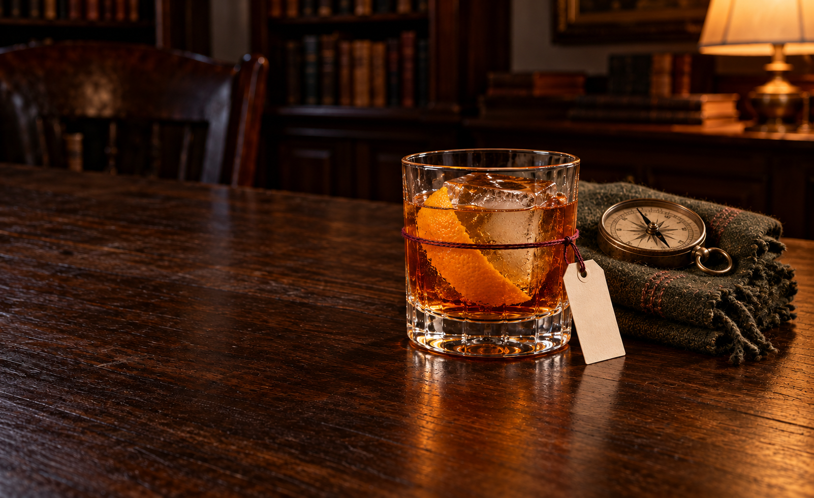

# Production batch08 — tag-physics review drafts

2026-10-07. Seven new cocktail scenes, plus the preceding user-directed [Hear Me Out attachment correction](hear-me-out-tag-physics-v3.md). Built-in image generation only. Each new initial and sole correction preserved; root inspected all seven selected original PNGs. Current dossier/spec/original/master copies, native dimensions and measured extents independently verified7/7. These are review drafts, not final JPEG pairs or release approval.

The tag check now follows a real support chain: stem/body loop → visible knot → short downward tether → punched paper hole → supported paper. Stemless glasses use a snug exterior body wrap below the rim; stemmed glasses use the narrow stem. Curvature, side occlusion, gravity and glass/table contact are recorded. No label is approved merely because it is present. Rear-loop/knot/friction uncertainty remains; Just Knew has an upper silhouette-overlap watch.

Current collection:77 generated candidate pairings,27 exported pairs,50 measured/unexported masters and38 ungenerated. All17 existing public pairs preserved; zero newly accepted/integrated,115 final pairs missing. No JPEG exporter invocation, rejected retry/bypass, new READY request, public/runtime/source/editorial changes, publishing or deployment. Earlier unanswered scoped export question does not cover this batch/current corrections. Browser batch user-deferred; heartbeat PAUSED.

Actual selected PNGs: four1672×941, one1671×941, Far Enough1602×982 and Just Knew1602×981. Those two have proper proposed1600×900 wide crops, not stretching. Required final1920×1080 wide /896×1200 portrait JPEGs remain outstanding. Proposed702px portraits are not389px moving-phone windows or glyph-fit evidence. Material/personality/physical-serving holds are separate from hash/geometry checks.

[Manifest](production-batch-08.json) · [Master audit](production-batch-08-master-audit.json) · [Tag correction receipt](hear-me-out-tag-physics-v3.json)

## Got You

Root inspected actual1672×941 PNG at original resolution. Glass321px high, pulled back from initial420px; not a phone composition PASS. Fullglass/paper/popper+streamers/saltcellar598px, conservative recognisable567px; proposed702portrait holds those visible objects, not narrower389pxmovingphone.

Small blank tag83pxhorizontal versus219pxbowl,69pxusableaxisat62°. Visible narrowstem twine loop below bowl/knot around1075/520, shortcontinuousdownwardtether to punchedhole1109/559, paper below support and separate beside stem, bottomclearofglassfoot/timber. Mechanically legible, rearloop partiallyoccluded and knot topology still a watch; no adhesive/rimhook/liquidanchor. Do not call loadtest/nameglyphpass.

Pale cloudy yellow drink no solidservingice/eggwhite/garnish/rim. Tiny fruiticecrystals vsmicrobubbles not chemically proved; uniformbowl speckling watched. Spentpoppertube/openend/limpstreamers and whole saltcellar+askewlid recognizable fullsize; source-grounded ordinary household-prank/birthday inferences, not actualpossessions or independent proof of welcomingmotive. No floatingstreamer/symbolarmy. Salt doublesrecipeprop, evidence genericwatch.

Warm glossy patterned timber inherited; kept material hold, don't inherit pilotapproval. Initialandsolefocusedcompositioncorrectionpreserved, no thirdcall/JPEG/browser/acceptance/publicintegration.

Actual1672×941; glass321px; full598px /essential-recognition567px spread; actual clean tag axis69px. No load/name/phone/material/personality approval from these measurements.

[Attachment and measurements](regular-guy-jester/v2/measurements.json) · [Root review](regular-guy-jester/v2/root-master-review.md) · [Owner review](regular-guy-jester/v2/review.md) · [Actual prompt](regular-guy-jester/v2/prompt.md) · [Readiness](regular-guy-jester/v2/readiness.md) · [Provenance](regular-guy-jester/v2/provenance.json) · [Actual initial prompt](regular-guy-jester/v1/prompt.md)

## Far Enough

Root inspected actual1602×982 native original PNG, not1672×941 or final16:9JPEG. Proposedwide crop1600×900 at0/41 does not stretch. Exterior burgundy midbody loop well below rim visibly follows curvature/side occlusion, right knot1126/478 and short continuous paired tether to punchedhole1149/539. Paper below knot with airgap beside glass, bottomrests timber~718; friction/load/farloop untested, not physics/name PASS.127px paper versus353px bowl,143px cleanaxis intentionally proportional. One large cube and insideorange peel in amber rocks drink coherent, but ice/glass dense etchedsparkle and glossyamber crackle timber held. Full pocketcompass/ordinary olive scarf recognizable walking/planning/turninghome inferences, not historical objects; visible precise repair not independently proven, functionaldial/pseudo-letter geometry watch. Glass418px/full781/recognition758 group too broad; proposed702portrait clips scarf. All prior scene/phone/personality/material holds retained. Initial+solecorrection exhausted, no JPEG/browser/acceptance/integration.

Actual1602×982; glass418px; full781px /essential-recognition758px spread; actual clean tag axis143px. No load/name/phone/material/personality approval from these measurements.

[Attachment and measurements](explorer-ruler/v2/measurements.json) · [Root review](explorer-ruler/v2/root-master-review.md) · [Owner review](explorer-ruler/v2/private-review.md) · [Actual prompt](explorer-ruler/v2/prompt.txt) · [Readiness](explorer-ruler/v2/readiness.md) · [Provenance](explorer-ruler/v2/provenance.json) · [Actual initial prompt](explorer-ruler/v1/prompt-batch08.txt)

## Just Knew

Root inspected actual1602×981 native original PNG. Midbody exterior burgundy twine loop below rim curves across front and disappears at sides, visible right knot1084/488 → continuous short downward paired tether → punchedhole1105/559. Paper below support, bottomrests timber~733. Mostpaper outboard but upperleft silhouette overlaps glass: realairgap at that overlap is not certain, keep attachment/separation watch rather than blanketphysicsPASS. Farloop/friction/load unobservable, no namefit.126px lateralpaper versus370px bowl,136px usableaxis intentionaldiscretion. Red ice-filled rocks/ONEinsideorange/nofoam; at leastthree visible oliveleaf regions cannotcertify ONEbayleaf torn into TWOhalves, garnishhold. Whole substantialold/newbookfaces and adultglovethumb/fingers/cuff recognizable ordinaryreading/longwalk evidence, not isolatedrightbrownpatch or literalhistoricalobjects; wornleatheruniformtexture watched. Glass455px/full764px/recognition709px;702portrait clips bookedges, no phonepass. Glossyambercrackledwood/etchedsparklingice/glass held. Initial+solecorrection exhausted, noJPEG/browser/acceptance/integration.

Actual1602×981; glass455px; full764px /essential-recognition709px spread; actual clean tag axis136px. No load/name/phone/material/personality approval from these measurements.

[Attachment and measurements](explorer-magician/v2/measurements.json) · [Root review](explorer-magician/v2/root-master-review.md) · [Owner review](explorer-magician/v2/private-review.md) · [Actual prompt](explorer-magician/v2/prompt.txt) · [Readiness](explorer-magician/v2/readiness.md) · [Provenance](explorer-magician/v2/provenance.json) · [Actual initial prompt](explorer-magician/v1/prompt-batch08.txt)

## First Choice

Root inspected actual1672×941 original PNG. Small tag is attached below bowl via visible narrow-stem loop, overlapping small knot, short downward tether and punched hole; paper lies below support with an air gap beside stem, above foot/table. No rim anchor or adhesive-looking face. Rear loop is occluded, exact knot topology uncertain; plausible visible support rather than absolute physics/name pass.68px paper width versus251px bowl,65px axis. Amber-red slightly hazy still coupe and peach at bottom read, no ice/foam/rim garnish; fine speckling risks carbonation ambiguity. Whole phone and household keyring recognisable; explicit Friday-phone source plus inferred ready-to-go keys, not literal possessions or independent emotional proof. Glass360px/full-recognition395px group is near movingphone389 but no clearance/PASS;702portrait retains visible group only. Warm glossy patterned timber/bright practical held. Initial plus sole correction preserved; no JPEG/browser/acceptance/integration.

Actual1672×941; glass360px; full395px /essential-recognition395px spread; actual clean tag axis65px. No load/name/phone/material/personality approval from these measurements.

[Attachment and measurements](regular-guy-lover/v2/measurements.json) · [Root review](regular-guy-lover/v2/root-master-review.md) · [Owner review](regular-guy-lover/v2/master-review.md) · [Actual prompt](regular-guy-lover/v2/prompt.txt) · [Readiness](regular-guy-lover/v2/readiness.md) · [Provenance](regular-guy-lover/v2/provenance.json) · [Actual initial prompt](regular-guy-lover/v1/prompt.txt)

## Their Night

Root inspected actual1672×941 original PNG. Small67px paper versus254px bowl,65px longaxis. Narrowstem cottonwrap below bowl → overlapping knot at stemright → continuous short downward tether → punchedhole; paper below support outside stem with glass/tableairgap, no rimanchor/glued face. Rearloop/knotdepth occluded, not absolutephysics/name/loadtest. Dusty pink hazy anise cocktail/no garnish/servingice/eggcap reads; near-rim speckles/line/haze-thickness watched. Used scissors and ribbon bundle fullsize/recognizable arranging-habit inferences, not literalpossessions or permission/meddling proof. Source-explicit party background does NOT confer userapproval: visible human profiles/hand-like shapes held against no-people-unless-approved constraint. Several warm practicals and brightleftlamp break one-source/quietleft grammar. Glossy amber patterned timber held. Glass411px, foreground491px and wholebackground-inclusive~649px spread;702portrait retains foreground but notphone/motionapproval. Initial+solecorrection exhausted, no JPEG/browser/acceptance/integration.

Actual1672×941; glass411px; full649px /essential-recognition491px spread; actual clean tag axis65px. No load/name/phone/material/personality approval from these measurements.

[Attachment and measurements](magician-caregiver/v2/measurements.json) · [Root review](magician-caregiver/v2/root-master-review.md) · [Owner review](magician-caregiver/v2/master-review.md) · [Actual prompt](magician-caregiver/v2/prompt.txt) · [Readiness](magician-caregiver/v2/readiness.md) · [Provenance](magician-caregiver/v2/provenance.json) · [Actual initial prompt](magician-caregiver/v1/prompt.txt)

## Don't Look at Me

Root inspected actual1672×941 PNG. Tag has snug lower-body twine front arc following cylindrical shape, side occlusion, visible right knot near1207/609 and short continuous descent through hole near1210/645. Small68px paper versus265px bowl and78px axis; hangs below support beside glass, no rimhook/liquidcrossing/adhesive face. Lowestcorner nearly touches timber; contact vs tiny freegap uncertain, no absolute physics/load/name PASS. Large350ml tumbler honors actual dossier, not queued highball label; pale strawgold/slight haze, three apparent cubes and lime half inside/no foam/rim. Lime remains freshlycut-looking rather than convincingly squeezed, held. Chair/scarf and usednapkin are generic shared-table inferences; fullvisible712px/recognition707px group, napkin truncated at rasterright and another10px by proposed702portrait. No invented unseen extent/phone acceptance. Glass355px, glossyamber scratched timber/busy scarf microtexture remain held. Initial+solecorrection exhausted; no JPEG/browser/acceptance/integration.

Actual1672×941; glass355px; full712px /essential-recognition707px spread; actual clean tag axis78px. No load/name/phone/material/personality approval from these measurements.

[Attachment and measurements](jester-ruler/v2/measurements.json) · [Root review](jester-ruler/v2/root-master-review.md) · [Owner review](jester-ruler/v2/review.md) · [Actual prompt](jester-ruler/v2/prompt.txt) · [Readiness](jester-ruler/v2/readiness.md) · [Provenance](jester-ruler/v2/provenance.json) · [Actual initial prompt](jester-ruler/v1/prompt.txt)

## On One Condition

Root inspected actual1671×941 native PNG, not assumed1672. Small51px lateral tag versus188px vessel,80px cleanaxis; lower-middle exterior body twine wraps the cylinder with visible front arc/side occlusion, right knot1151/610 → short downward continuous cord → hole1157/634 → paper below support, free beside wall with bottomclear of timber. Fine fararc/knot strand depth remains uncertain, no load/name/absolutephysics PASS. Tall Collins with cubes, ONE upright rosemary and palegold slightly hazy carbonated body/nofoam reads; warmth, dense decorative etched ice and uniformly granular glass remain held. Cassette in real connected open case and blank toastcard/pencil are recognisable fullsize playlist/toast format inferences, not literal possessions; specificity watch. Glass407px/garnish to270, wholecocktail-inclusive full579px/recognition572px spread;702portrait not389movingphone PASS. Glossyamber patterned scratchedwood held. Initial+solecorrection exhausted, no JPEG/browser/acceptance/integration.

Actual1671×941; glass407px; full579px /essential-recognition572px spread; actual clean tag axis80px. No load/name/phone/material/personality approval from these measurements.

[Attachment and measurements](magician-creator/v2/measurements.json) · [Root review](magician-creator/v2/root-master-review.md) · [Owner review](magician-creator/v2/review.md) · [Actual prompt](magician-creator/v2/prompt.txt) · [Readiness](magician-creator/v2/readiness.md) · [Provenance](magician-creator/v2/provenance.json) · [Actual initial prompt](magician-creator/v1/prompt.txt)
