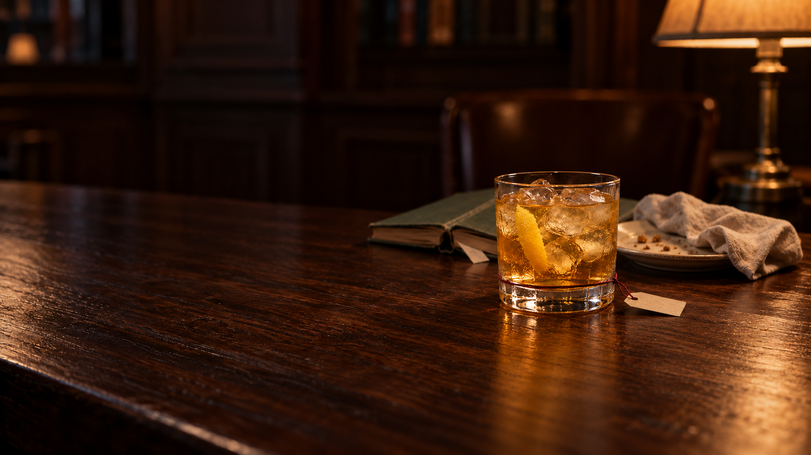
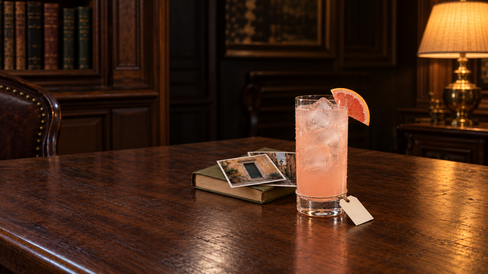
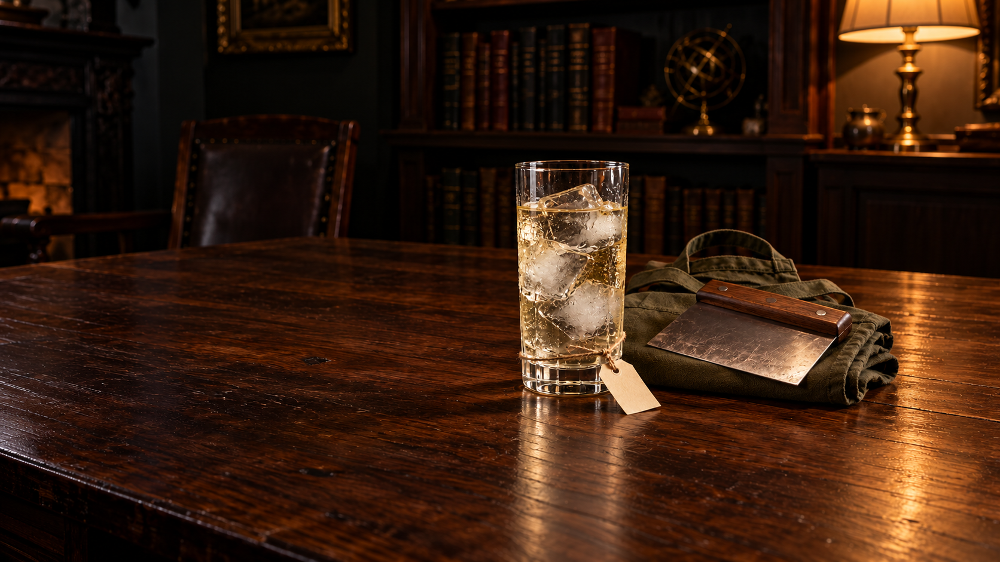
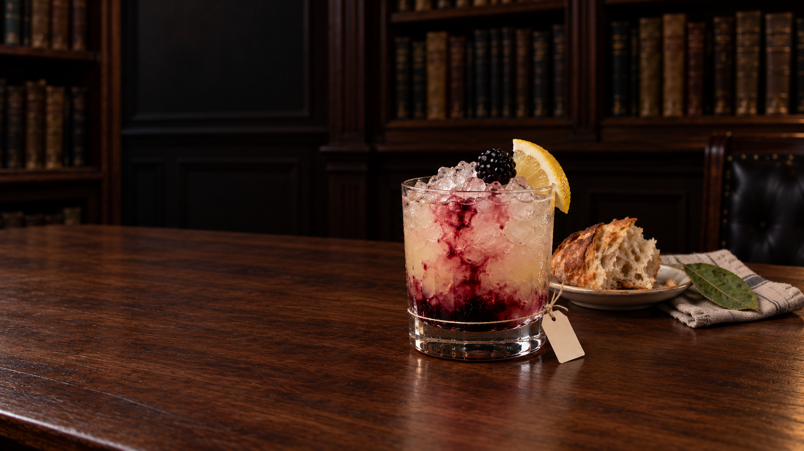
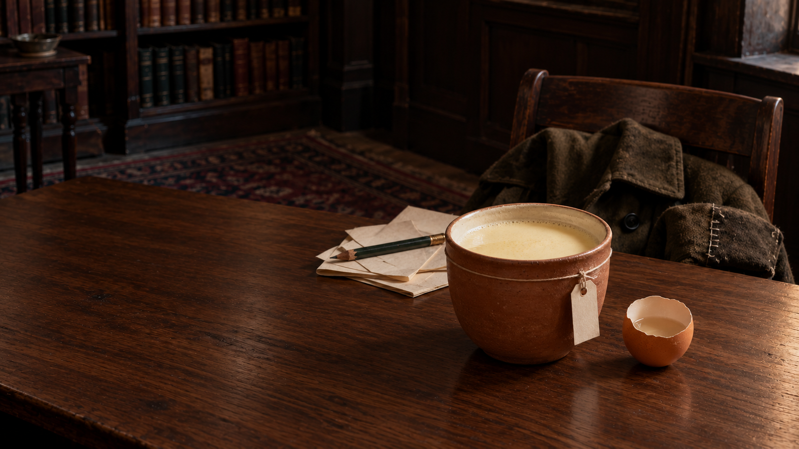
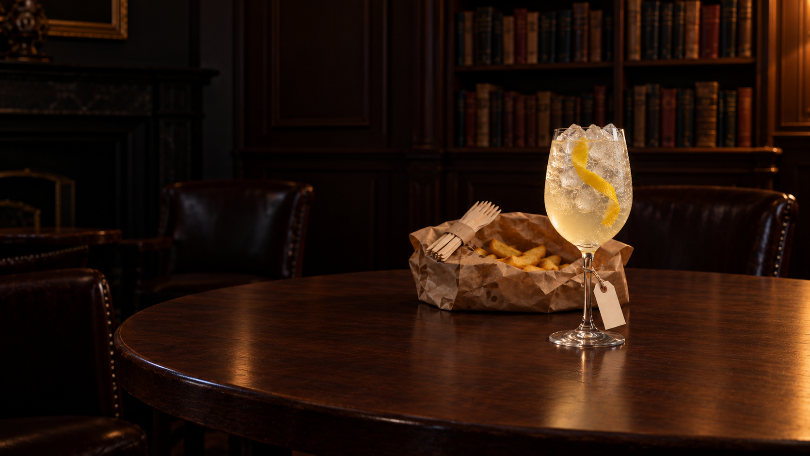

# Production batch10 — Further Than Me correction + seven new drafts

7 October. Built-in image generation only. Eight selected native PNG scenes inspected at original detail; these are **held drafts**, not final exports or approval. Six new finals1672×941, Just This Once1671×941. Seven new pairings use initial +sole focused edit; Further Than Me uses two explicit user-directed edits. All16 original copies preserved. Technical hash/dimension/extents checks do not clear realism/personality/physics/name/phone gates.

Current91 generated /27 exported /64 measured-unexported /24 ungenerated. No JPEG export, new browser request, public/runtime/source/editorial change. Browser checks deferred, heartbeatPAUSED. Small labels are not enlarged to old writing-width heuristic.

## Further Than Me — lower tag, richer quiet care

Cord now much lower at upper clear-foot transition; discreet paper rests outboard on timber. The Mentor is restrained, not a minimalist identity: existing phone/spectacles plus inferred repaired cardigan add warmth, without recipe ingredient clutter. The cardigan is currently wide-only; portrait recomposition and material/attachment/glyph review remain. This does not prove the band lies completely below all liquid projections.

[Correction receipt](further-than-me-base-tag-v4.md) · [first actual prompt](sage-caregiver/v3/prompt.md) · [actual height-edit prompt](sage-caregiver/v4/prompt.md) · [readiness](sage-caregiver/v4/readiness.md) · [measurements](sage-caregiver/v4/measurements.json) · [root review](sage-caregiver/v4/root-master-review.md) · [provenance](sage-caregiver/v4/provenance.json)

## Look Again

Smaller rocks glass and paper; face-down book/used supper remain spread. Amber glossy wood/dense glass-ice, extra left practical and pale-gold appearance held. Proposed portrait clips essential traces. Full/recognition group899/878px; source portrait is not ~389px moving-phone acceptance. Small name axis95px, actual glyphs untested.

[Actual initial prompt](sage-explorer/v1/prompt.md) · [actual correction prompt](sage-explorer/v2/prompt.md) · [readiness](sage-explorer/v2/readiness.md) · [measurements](sage-explorer/v2/measurements.json) · [owner review](sage-explorer/v2/review.md) · [root review](sage-explorer/v2/root-master-review.md) · [provenance](sage-explorer/v2/provenance.json)

## Brought Home

Paloma and pink grapefruit wedge; place photos + book recognizable but phone spread, glossy wood/ice and base-transition knot uncertainty held. Full/recognition group627/623px; source portrait is not ~389px moving-phone acceptance. Small name axis88px, actual glyphs untested.

[Actual initial prompt](explorer-regular-guy/v1/prompt-batch10.txt) · [actual correction prompt](explorer-regular-guy/v2/prompt.txt) · [readiness](explorer-regular-guy/v2/readiness.md) · [measurements](explorer-regular-guy/v2/measurements.json) · [owner review](explorer-regular-guy/v2/private-review.md) · [root review](explorer-regular-guy/v2/root-master-review.md) · [provenance](explorer-regular-guy/v2/provenance.json)

## Let's Try It

Apron + separate scraper from baking-friend hope. Still-water drink has bubblelike speckle; glossy wood/ice, lighting and phone spread held. Full/recognition group642/636px; source portrait is not ~389px moving-phone acceptance. Small name axis71px, actual glyphs untested.

[Actual initial prompt](innocent-magician/v1/prompt.txt) · [actual correction prompt](innocent-magician/v2/prompt.txt) · [readiness](innocent-magician/v2/readiness.md) · [measurements](innocent-magician/v2/measurements.json) · [owner review](innocent-magician/v2/private-review.md) · [root review](innocent-magician/v2/root-master-review.md) · [provenance](innocent-magician/v2/provenance.json)

## Straight Back

Bramble red-purple drizzle/crushed ice, bread-sharing and crushed-leaf scent source habits. Portrait misses leaf, linen native-clipped; glossy wood/ice held. Full/recognition group837/750px; source portrait is not ~389px moving-phone acceptance. Small name axis77px, actual glyphs untested.

[Actual initial prompt](explorer-lover/v1/prompt-batch10.txt) · [actual correction prompt](explorer-lover/v2/prompt-batch10.txt) · [readiness](explorer-lover/v2/readiness-batch10.md) · [measurements](explorer-lover/v2/measurements.json) · [owner review](explorer-lover/v2/review.md) · [root review](explorer-lover/v2/root-master-review.md) · [provenance](explorer-lover/v2/provenance.json)

## The Wink

Nog in earthenware with method-required mezcal half-shell. Blank joke-work/repaired coat inferred; tag still flush against ceramic, wide group and cool window held. Full/recognition group1004/969px; source portrait is not ~389px moving-phone acceptance. Small name axis100px, actual glyphs untested.

[Actual initial prompt](jester-hero/v1/prompt-batch10.txt) · [actual correction prompt](jester-hero/v2/prompt-batch10.txt) · [readiness](jester-hero/v2/readiness-batch10.md) · [measurements](jester-hero/v2/measurements.json) · [owner review](jester-hero/v2/review.md) · [root review](jester-hero/v2/root-master-review.md) · [provenance](jester-hero/v2/provenance.json)

## Rent-Free

Wine/soda ice wine glass, no bay served. Arrival/unpacking bag and key inferred; broad bag/phone, material/sparkle and rear stem-wrap held. Full/recognition group631/631px; source portrait is not ~389px moving-phone acceptance. Small name axis77px, actual glyphs untested.

[Actual initial prompt](outlaw-lover/v1/prompt-batch10.txt) · [actual correction prompt](outlaw-lover/v2/prompt-batch10.txt) · [readiness](outlaw-lover/v2/readiness-batch10.md) · [measurements](outlaw-lover/v2/measurements.json) · [owner review](outlaw-lover/v2/master-review.md) · [root review](outlaw-lover/v2/root-master-review.md) · [provenance](outlaw-lover/v2/provenance.json)

## Just This Once

French75 over ice with yellow peel IN. Chips parcel + sharing forks source-grounded/inferred; calmer walnut but phone/framing/material watch remains. Full/recognition group470/470px; source portrait is not ~389px moving-phone acceptance. Small name axis68px, actual glyphs untested.

[Actual initial prompt](regular-guy-outlaw/v1/prompt-batch10.txt) · [actual correction prompt](regular-guy-outlaw/v2/prompt-batch10.txt) · [readiness](regular-guy-outlaw/v2/readiness-batch10.md) · [measurements](regular-guy-outlaw/v2/measurements.json) · [owner review](regular-guy-outlaw/v2/master-review.md) · [root review](regular-guy-outlaw/v2/root-master-review.md) · [provenance](regular-guy-outlaw/v2/provenance.json)

## Review scope

Visible support chains reviewed individually: exterior body/stem loop, front curvature/side occlusion, knot, downward tether, paper hole and gravity/contact. Rear closure, friction/load and contact/gap uncertainties are not a blanket physics PASS. The Wink remains visibly flush. Ingredients never stand in for person evidence. The Wink's rinsed half-shell/5ml mezcal is a settled dossier-method7 accompaniment, documented candidate pilot exception, not an invented second cocktail glass or a new shared recipe.

[Machine-readable manifest](production-batch-10.json) · [technical native-master receipt](production-batch-10-master-audit.json) · [Further Than Me technical receipt](further-than-me-base-tag-v4-audit.json)
