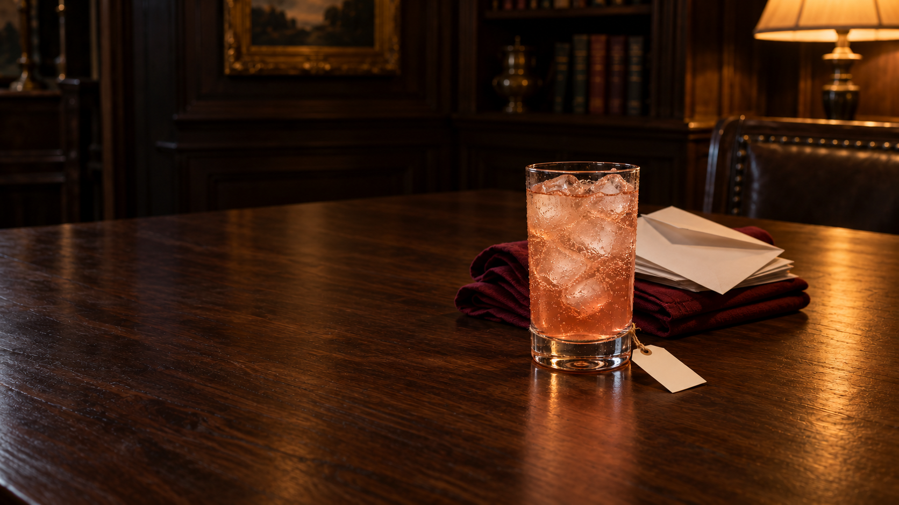
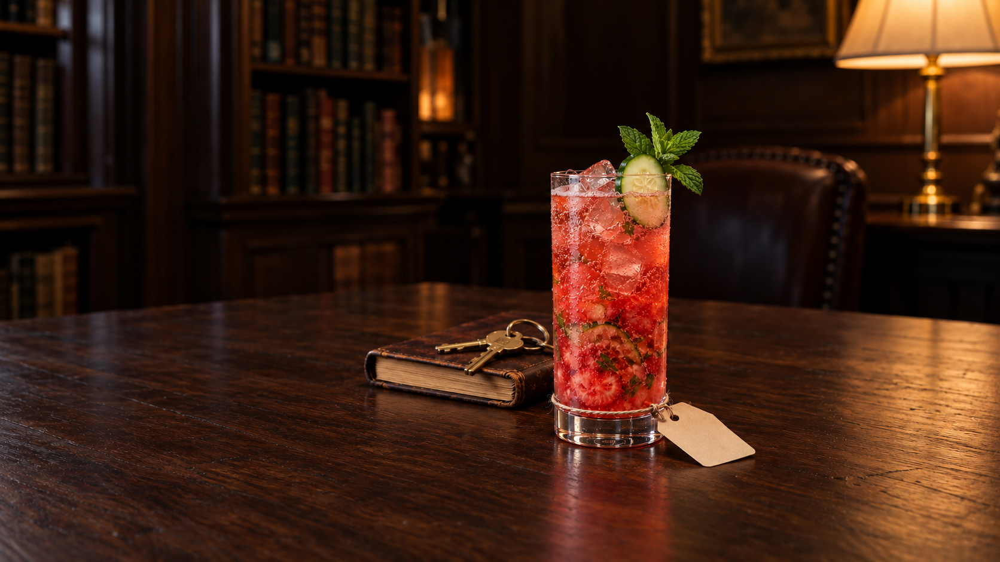

# Production batch11 — seven new cocktail drafts

7 October. All seven selected native PNG originals inspected at full size. One initial plus at most one focused edit each; fourteen exact originals preserved. Six selected1672×941, Hold the Shark1641×958 with a measured wide-crop proposal. These are **held drafts**, not final JPEGs or approved integrations.

98 generated /27 exported /71 measured-unexported /17 ungenerated. Browser checks deferred, heartbeatPAUSED; live app and existing public assets unchanged. No exporter invocation, blocked retry or bypass. Small labels remain discreet; actual names are untested.

## Note to Self

Pulled-back highball, closed notebook/pencil and bread from oven-timing habit. Pale straw currently amber; cube count/depth, fire plus lamp and glossywood/ice held. Full788px/recognition684px; proposedportrait clips notebook/linen, phone held. Clean writing axis93px; actual name fit untested. Tag rear-loop/friction/load and tiny knot/gap/contact uncertainty remain held, not physicsPASS.

[Actual initial prompt](sage-ruler/v1/prompt.md) · [Actual correction prompt](sage-ruler/v2/prompt.md) · [Readiness](sage-ruler/v2/readiness.md) · [Measurements](sage-ruler/v2/measurements.json) · [Owner review](sage-ruler/v2/review.md) · [Root review](sage-ruler/v2/root-master-review.md) · [Provenance](sage-ruler/v2/provenance.json)

## More Than One Head

Monthly-dinner hosting through napkins and invitations. Rosyamber highball no garnish; denseice/glass and glossywood held. Full664px/recognition630px; nominalportrait fit is not movingphone acceptance. Clean writing axis83px; actual name fit untested. Tag rear-loop/friction/load and tiny knot/gap/contact uncertainty remain held, not physicsPASS.

[Actual initial prompt](magician-innocent/v1/prompt.txt) · [Actual correction prompt](magician-innocent/v2/prompt.txt) · [Readiness](magician-innocent/v2/readiness.md) · [Measurements](magician-innocent/v2/measurements.json) · [Owner review](magician-innocent/v2/private-review.md) · [Root review](magician-innocent/v2/root-master-review.md) · [Provenance](magician-innocent/v2/provenance.json)

## Had to Be Serious

Budget/stayed-to-run workbook and keyring, red Pimm's Cup/mint/cucumber. PHYSICAL HOLD: strawberries still too sliced/whole, not convincingly muddled pulp; interior greens ambiguous. Full656px/recognition652px; near-top mint/phone and wood/ice/upperpaper-gap held. Clean writing axis103px; actual name fit untested. Tag rear-loop/friction/load and tiny knot/gap/contact uncertainty remain held, not physicsPASS.

[Actual initial prompt](ruler-outlaw/v1/prompt.txt) · [Actual correction prompt](ruler-outlaw/v2/prompt.txt) · [Readiness](ruler-outlaw/v2/readiness.md) · [Measurements](ruler-outlaw/v2/measurements.json) · [Owner review](ruler-outlaw/v2/private-review.md) · [Root review](ruler-outlaw/v2/root-master-review.md) · [Provenance](ruler-outlaw/v2/provenance.json)

## Show Your Working

Private question notebook and clean answer packet. Zombie, one mint sprig, no flame; generic office-work specificity/material held. Full865px/recognition847px including all mint/ice; proposedportrait clips notebook, phone held. Clean writing axis73px; actual name fit untested. Tag rear-loop/friction/load and tiny knot/gap/contact uncertainty remain held, not physicsPASS.

[Actual initial prompt](explorer-sage/v1/prompt-batch11.txt) · [Actual correction prompt](explorer-sage/v2/prompt-batch11.txt) · [Readiness](explorer-sage/v2/readiness-batch11.md) · [Measurements](explorer-sage/v2/measurements.json) · [Owner review](explorer-sage/v2/review.md) · [Root review](explorer-sage/v2/root-master-review.md) · [Provenance](explorer-sage/v2/provenance.json)

## Hold the Shark

Raincoat and retelling-work book; not visually proved scrapbook. Mai Tai with big mint branch and visibly spent half-lime cutsideup. Native1641x958; full919px/recognition910px, physicalserve alone488px; portrait loses book/cuff, phone held. Longer-than-ideal tether, wood/glassice held. Clean writing axis80px; actual name fit untested. Tag rear-loop/friction/load and tiny knot/gap/contact uncertainty remain held, not physicsPASS.

[Actual initial prompt](hero-jester/v1/prompt-batch11.txt) · [Actual correction prompt](hero-jester/v2/prompt-batch11.txt) · [Readiness](hero-jester/v2/readiness-batch11.md) · [Measurements](hero-jester/v2/measurements.json) · [Owner review](hero-jester/v2/review.md) · [Root review](hero-jester/v2/root-master-review.md) · [Provenance](hero-jester/v2/provenance.json)

## Quote Me

Put-down fork/starter and coat from dinner/bycoats behavior. Clear still rum/banana, orangepeel IN, NOICE. Full860px; named-recognition rectangles849px (owner conservative860px). Portrait truncates plate/coat, phone/material/thaw/fill held. Clean writing axis72px; actual name fit untested. Tag rear-loop/friction/load and tiny knot/gap/contact uncertainty remain held, not physicsPASS.

[Actual initial prompt](jester-outlaw/v1/prompt-batch11.txt) · [Actual correction prompt](jester-outlaw/v2/prompt-batch11.txt) · [Readiness](jester-outlaw/v2/readiness-batch11.md) · [Measurements](jester-outlaw/v2/measurements.json) · [Owner review](jester-outlaw/v2/master-review.md) · [Root review](jester-outlaw/v2/root-master-review.md) · [Provenance](jester-outlaw/v2/provenance.json)

## Good for Years

Coat zip and old lamp from repair habits. Onecube and inherent marmalade shreds; addedgarnish none. Hairgrip/repaired-flex identification null/unproven; power continuity hidden/right-clipped. Full/recogn875px, lamp top69/portrait/phone held. Timber flatter but still warmgloss/materialwatch. Clean writing axis60px; actual name fit untested. Tag rear-loop/friction/load and tiny knot/gap/contact uncertainty remain held, not physicsPASS.

[Actual initial prompt](regular-guy-magician/v1/prompt-batch11.txt) · [Actual correction prompt](regular-guy-magician/v2/prompt-batch11.txt) · [Readiness](regular-guy-magician/v2/readiness-batch11.md) · [Measurements](regular-guy-magician/v2/measurements.json) · [Owner review](regular-guy-magician/v2/master-review.md) · [Root review](regular-guy-magician/v2/root-master-review.md) · [Provenance](regular-guy-magician/v2/provenance.json)

## Review scope

Drink → person → pour remains the hierarchy. Ordinary source-backed habits replace old impossible-detail briefs; inferred formats/ownership are recorded as inferences. Functional metal stays permitted, timber defines the room. Individual low-body support chains were inspected, but hidden closure/friction/load and actual glyph/phone performance are not proved by photographs. All physical garnish, ice and recipe shreds are included; no anonymous fragments or invented unseen extents count as personality recognition. Material and serving issues stay candidly held.

[Manifest](production-batch-11.json) · [Technical native-master receipt](production-batch-11-master-audit.json) · [Final continuity checks](production-batch-11-final-checks.json)
