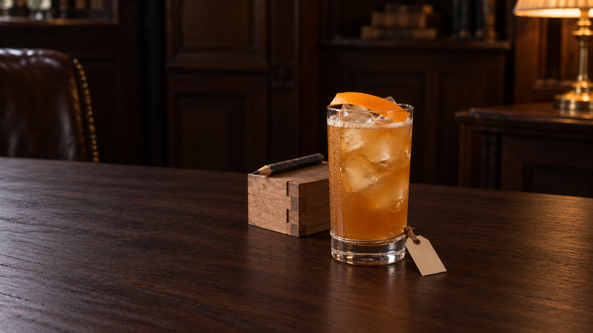
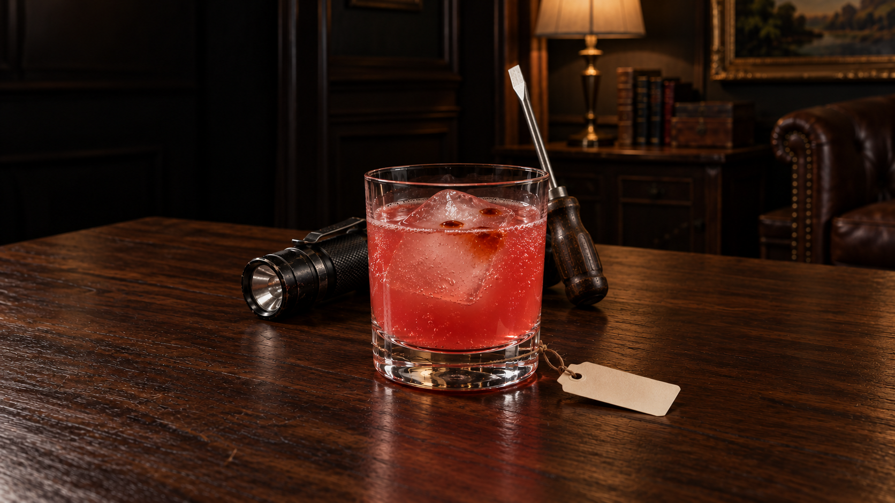

# Production batch12 — seven new cocktail drafts

7 October. Seven actual selected PNG originals independently inspected at full size. One initial plus one focused edit each; fourteen exact originals preserved. Six selected1672×941, Anyone Would Have1672×940. These are **held drafts**, not final JPEGs or approved integrations.

105 generated /27 exported /78 measured-unexported /10 ungenerated. Browser checks deferred, heartbeat PAUSED; live app and existing public assets unchanged. No exporter invocation, blocked retry or bypass.

The latest cord refinement is in the house rules: thin matte neutral thread, low support, small knot, trimmed ends and very short tether. Never remove the evidence that explains how a paper tag is supported. Most selected labels are quieter; The Long Answer still has a coiled wrap and Hoping You'd Come retains small turns. Those outcomes are held, not described as fixed. Actual names remain untested.

## The Long Answer

The Long Answer solecordedit retains several tanstemturns/tail; not single-strand success. Replies/page/bluepen guestinferences; all fruit/mint included. Broad amber cracklewood/coolwindow+lamp/sparklyice; portrait clips leftletters/pen, phone/name held.

Full group783px / recognition765px; physical garnish, ice, spoon and straw included where served. Clean writing axis125px; actual glyph fit untested. Front support chain inspected, hidden closure/friction/load and local gap/contact uncertain—not physics PASS. Proposed crops only, not exported or phone-accepted.

[Actual initial prompt](hero-creator/v1/prompt.md) · [Actual correction prompt](hero-creator/v2/prompt.md) · [Readiness](hero-creator/v2/readiness.md) · [Measurements](hero-creator/v2/measurements.json) · [Owner review](hero-creator/v2/review.md) · [Root review](hero-creator/v2/root-master-review.md) · [Provenance](hero-creator/v2/provenance.json)

## Work It Out

Work It Out lowtaupebodyloop/short tether/paperoutboard quieter. Learning/reworking joinerysample+pencil INFERRED, not occupation. Pseudo-diagram lines remain sampleface; glossywood/facetedice/droplets/phone held. Orangepeel laidONice and thin shakefroth; no creamyhead.

Full group560px / recognition545px; physical garnish, ice, spoon and straw included where served. Clean writing axis85px; actual glyph fit untested. Front support chain inspected, hidden closure/friction/load and local gap/contact uncertain—not physics PASS. Proposed crops only, not exported or phone-accepted.

[Actual initial prompt](hero-innocent/v1/prompt-batch12.txt) · [Actual correction prompt](hero-innocent/v2/prompt-batch12.txt) · [Readiness](hero-innocent/v2/readiness-batch12.md) · [Measurements](hero-innocent/v2/measurements.json) · [Owner review](hero-innocent/v2/private-review.md) · [Root review](hero-innocent/v2/root-master-review.md) · [Provenance](hero-innocent/v2/provenance.json)

## Anyone Would Have

Anyone Would Have subdued lowfootcord, but longer thanintended link/tails. Torch+screwdriver INFERRED from preparation/fuseboxhabit; tall screwdrivertip/support held. 3neatAngoblotches appearanceHOLD; source ONTOP can includeice, not inherently recipeviolation. Native1672x940; ice/wood/crop/name held.

Full group822px / recognition822px; physical garnish, ice, spoon and straw included where served. Clean writing axis176px; actual glyph fit untested. Front support chain inspected, hidden closure/friction/load and local gap/contact uncertain—not physics PASS. Proposed crops only, not exported or phone-accepted.

[Actual initial prompt](hero-regular-guy/v1/prompt-batch12.txt) · [Actual correction prompt](hero-regular-guy/v2/prompt-batch12.txt) · [Readiness](hero-regular-guy/v2/readiness-batch12.md) · [Measurements](hero-regular-guy/v2/measurements.json) · [Owner review](hero-regular-guy/v2/private-review.md) · [Root review](hero-regular-guy/v2/root-master-review.md) · [Provenance](hero-regular-guy/v2/provenance.json)

## Hoping You'd Come

Hoping You'd Come smallwineglass/coldapplepulp/1lump/spoonIN. Tiny neutralstemcord still2–3turns, contactfoot-vs-timber uncertain. Preparedemptychair explicit/knitthrow inferred, broadphonegroup. Coarseapple/patternedamberwood/droplets/name held; includeALLspoon.

Full group783px / recognition602px; physical garnish, ice, spoon and straw included where served. Clean writing axis62px; actual glyph fit untested. Front support chain inspected, hidden closure/friction/load and local gap/contact uncertain—not physics PASS. Proposed crops only, not exported or phone-accepted.

[Actual initial prompt](lover-caregiver/v1/prompt-batch12.txt) · [Actual correction prompt](lover-caregiver/v2/prompt-batch12.txt) · [Readiness](lover-caregiver/v2/readiness-batch12.md) · [Measurements](lover-caregiver/v2/measurements.json) · [Owner review](lover-caregiver/v2/review.md) · [Root review](lover-caregiver/v2/root-master-review.md) · [Provenance](lover-caregiver/v2/provenance.json)

## The Kind You'd Want

The Kind You'd Want lowthinbrowncord/tinyknot/13pxholelink/outboardpaper quieter, nameaxis48px untested. Small everydaytumbler/ice/ONElemonpeelIN. Keys underbananas read; mugpairrecognizable but turnedEmptyMugs recognitionnull/wallwardorientation+emptycontents unproven. Amberwood/densefizz/ice/phone held.

Full group448px / recognition447px; physical garnish, ice, spoon and straw included where served. Clean writing axis48px; actual glyph fit untested. Front support chain inspected, hidden closure/friction/load and local gap/contact uncertain—not physics PASS. Proposed crops only, not exported or phone-accepted.

[Actual initial prompt](jester-magician/v1/prompt-batch12.txt) · [Actual correction prompt](jester-magician/v2/prompt-batch12.txt) · [Readiness](jester-magician/v2/readiness-batch12.md) · [Measurements](jester-magician/v2/measurements.json) · [Owner review](jester-magician/v2/review.md) · [Root review](jester-magician/v2/root-master-review.md) · [Provenance](jester-magician/v2/provenance.json)

## For Its Own Good

For Its Own Good onecube/grappa/Nebbiolosyrup/no garnish. Lowneutralbodyloop/shortpunchedholelink plausiblefront, slightlybright/doubledknot held. Weekendbag/openbinder inference genericandwide; bindernative-rightclipped/unseenextentnull. Darkliquid/highfill/ice/wood/coolwindow+lamp/name/phone held.

Full group1104px / recognition1104px; physical garnish, ice, spoon and straw included where served. Clean writing axis117px; actual glyph fit untested. Front support chain inspected, hidden closure/friction/load and local gap/contact uncertain—not physics PASS. Proposed crops only, not exported or phone-accepted.

[Actual initial prompt](outlaw-magician/v1/prompt-batch12.txt) · [Actual correction prompt](outlaw-magician/v2/actual-prompt-batch12.txt) · [Readiness](outlaw-magician/v2/readiness-batch12.md) · [Measurements](outlaw-magician/v2/measurements.json) · [Owner review](outlaw-magician/v2/master-review.md) · [Root review](outlaw-magician/v2/root-master-review.md) · [Provenance](outlaw-magician/v2/provenance.json)

## Who's In?

Who's In? whipshaken/packedcrushedice/mound, TWO raspberries/ONEmintsprig/straw and internalmint; selected allowed+2.5mlsyrup only. Smalllowtaupe single-looking chain quieter, projectiongap/rearloadunknown. Gloves/screenoffphone inferred; fullstraw/ice/garnish+traces too wide forphone; timber/ice/name held.

Full group553px / recognition553px; physical garnish, ice, spoon and straw included where served. Clean writing axis49px; actual glyph fit untested. Front support chain inspected, hidden closure/friction/load and local gap/contact uncertain—not physics PASS. Proposed crops only, not exported or phone-accepted.

[Actual initial prompt](ruler-jester/v1/actual-prompt-batch12.txt) · [Actual correction prompt](ruler-jester/v2/actual-prompt-batch12.txt) · [Readiness](ruler-jester/v2/readiness-batch12.md) · [Measurements](ruler-jester/v2/measurements.json) · [Owner review](ruler-jester/v2/master-review.md) · [Root review](ruler-jester/v2/root-master-review.md) · [Provenance](ruler-jester/v2/provenance.json)

## Review scope

Drink → person → pour remains the hierarchy. Settled recipes and editorial status unchanged; tagline approval is not required for image generation. Everyday source-backed habits replace old impossible-detail briefs; inferred props and ownership are recorded honestly. Functional metal remains permitted, with timber defining the room. Unknown hidden/native-clipped extents and unproven behavioral recognition are not invented: The Kind You'd Want's turned-empty-mug evidence remains null. Anyone Would Have's source says bitters ON TOP; landing on ice is not inherently a recipe violation, but the three neat blotches are an appearance hold. Glass height alone excludes served spoon/straw/garnish and cannot establish phone fit.

Recognition groups447–1104px do not clear the moving-phone gate. Some proposed portrait crops lose personality evidence. Glossy amber timber, repetitive glass/ice textures, liquid appearance, person-specificity and actual name fit remain held. JPEG export permission remains unresolved for this batch; no export retry, browser request, public asset or application change. All seven are private measured masters awaiting later batch review.

[Manifest](production-batch-12.json) · [Technical native-master receipt](production-batch-12-master-audit.json) · [Final continuity checks](production-batch-12-final-checks.json)
