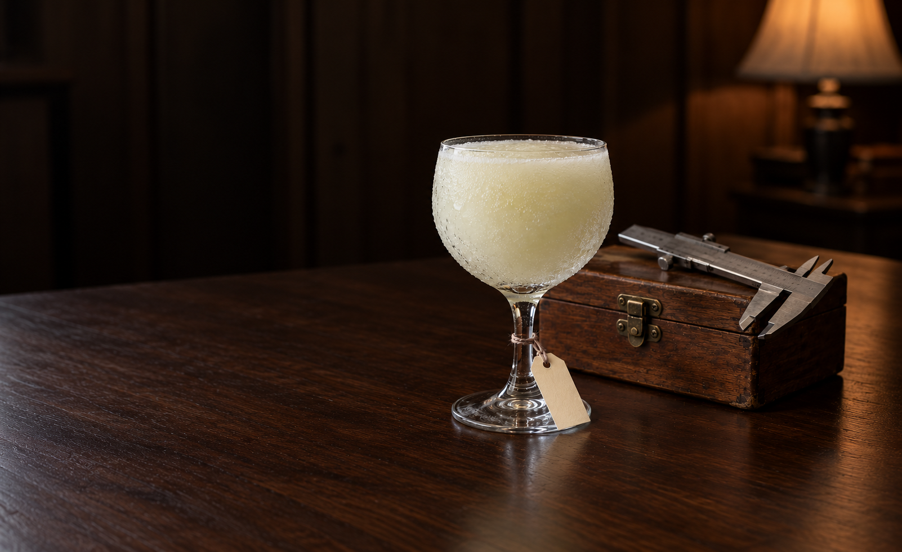
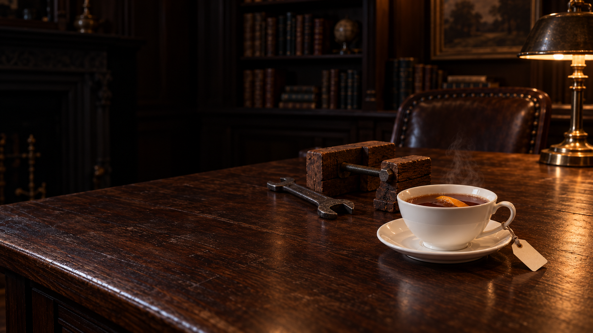
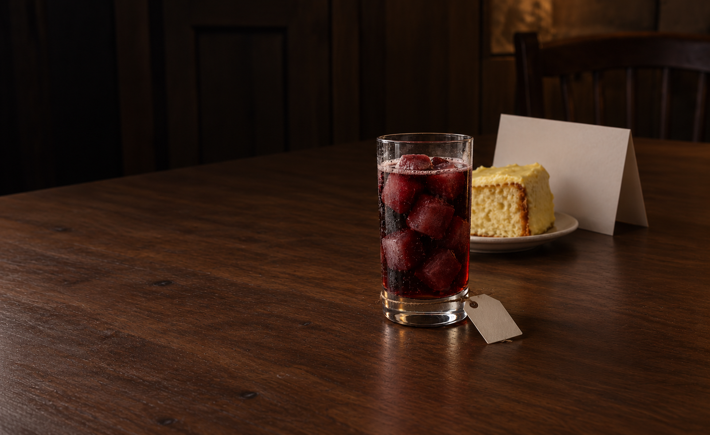
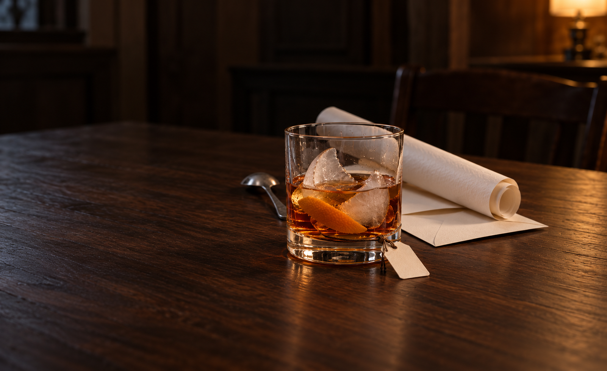
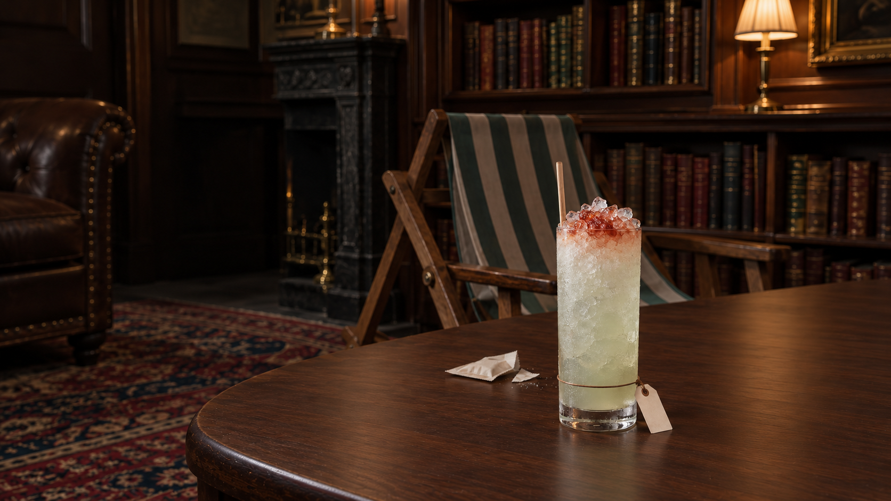
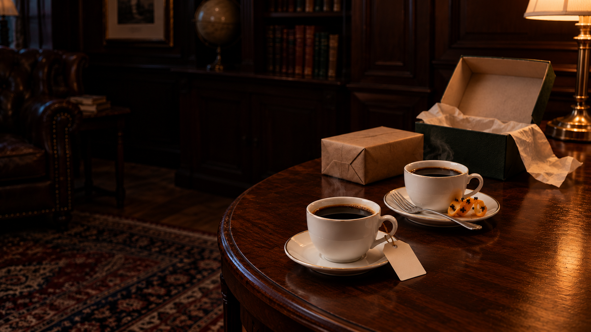
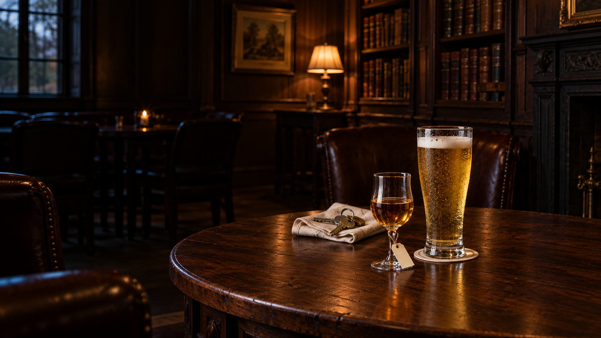
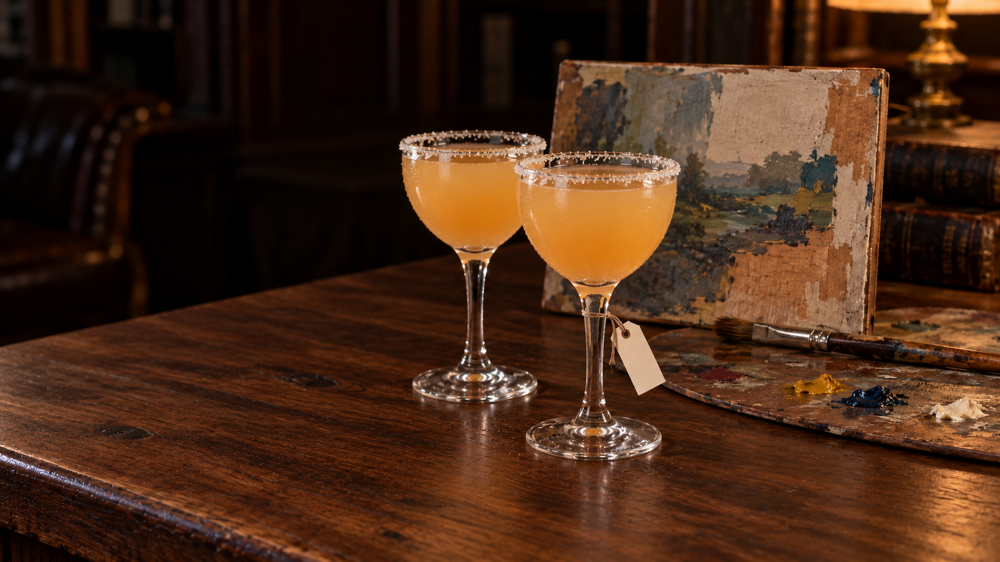
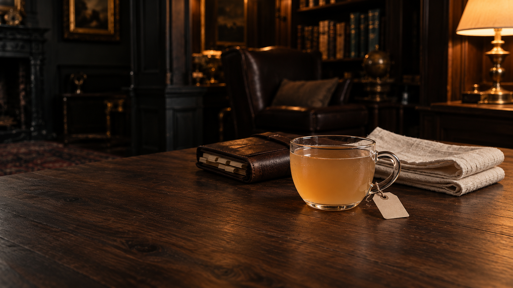

# Batch13 — the last ten drafts, plus Who’s In? ice revision

7October2026. Actual native originals below; **private review drafts, not final
exports or live assets**. Built-in image generation used; exact prompts saved
per version. Twenty-two bounded initial/focused-edit calls, all originals
preserved. Root inspected all eleven selected native images.

The ten finish initial candidate coverage: **17 existing images +115 new
pairing drafts =132 pairings represented**. No new final acceptance or live
integration.88 measured masters await JPEG exports; browser batch deferred
and heartbeat remains PAUSED. Native masters are three1602×981, six1672×941,
one1672×940; measured wide16:9 and portrait crops are proposals only, not exported
1920×1080/896×1200 assets or animated phone/name tests.

Recipe first: these include actual frozen wine-cola cubes, cracked cup-shaped
ice, hot china, TWO coffees/TWO NickNoras, an unmixed rye+beer pair, three cordial
layers and ONE cold handled punch. See [serving pilot ledger](production-batch-13-serving-pilots.md).
These are private truthful-serving exceptions, not global final design approval.

Remaining review issues are explicit: orange-gloss/crackled timber, dense
ice/glass texture, broad or clipped personality evidence, retained cord turns/
tails, and unknown rear tag closure/load. **I’ll Tell You Later still has more
than SIX clove-like heads on its used preparation spiral: physical-count HOLD.**
Front support evidence is not unconditional physics PASS. Full visible box/
roll/envelope recognition is measured, not catch/spiral fragments only; hidden
history/parts unknown.

## Who’s In? — targeted ice-only v4

Flatter asymmetric chips replace many round bead silhouettes; rounded scallops
and uniform gloss persist, **realism HOLD—not fully natural/fixed**. Recipe,
garnish, vessel, tag and personality preserved. [Correction report](whos-in-crushed-ice-v4.md),
[measurements](ruler-jester/v4/measurements.json), [actual prompt](ruler-jester/v4/prompt.md).
v2/v3 remain preserved.

## For Good

Native1602×981 viewed. ONE frozen off-white goblet portion, no cubes/garnish. Full calipers and handled wooden box identifiable, but repaired hinge and actual measured scale not proved; WHO craft traces inferred. Frozen glass/liquid still dense speckle, glossy amber/cracked timber held. Multi-turn stem cord and tails visible despite subdued instruction; rear closure/friction unknown. Paper face clear and wood-supported, no unconditional physics PASS. Full group740px and glass532px imply phone/composition hold; name untested.

[Selected native](explorer-creator/v2/master.png) · [Original prompt](explorer-creator/v1/prompt-batch13.md) ·
[Actual focused-edit prompt](explorer-creator/v2/prompt-batch13.md) · [Readiness](explorer-creator/v2/readiness-batch13.md) ·
[Provenance](explorer-creator/v2/provenance.json) · [Measured tag/glass/crops](explorer-creator/v2/measurements.json) ·
[Owner review](explorer-creator/v2/private-review.md) · [Root original review](explorer-creator/v2/root-master-review.md)

## Why Not?

ONE hot china cup/saucer, orange peel IN, no ice. Explicit spanner + inferred drawer jig plausible; opacity estimate, amber crackle wood, cord topology and full-tool phone spread held.

[Selected native](explorer-jester/v2/master.png) · [Original prompt](explorer-jester/v1/actual-prompt-batch13.txt) ·
[Actual focused-edit prompt](explorer-jester/v2/actual-prompt-batch13.txt) · [Readiness](explorer-jester/v2/readiness-batch13.md) ·
[Provenance](explorer-jester/v2/provenance.json) · [Measured tag/glass/crops](explorer-jester/v2/measurements.json) ·
[Owner review](explorer-jester/v2/master-review.md) · [Root original review](explorer-jester/v2/root-master-review.md)

## The Way It Felt

Native1602×981 viewed. ONE tall red-brown wine/cola serve with softened opaque BURGUNDY frozen-wine-cola cubes rather than clear water ice; thin tanpink fizz, no garnish. Yellow homemade-looking cakepiece and blank folded card readable; handdrawn face hidden and cake/dense glass textures still watch. Low clear-foot neutral thread and short hole tether quieter, paper outside and wood-supported; rear/topology unknown. Group615px and glass439px, portrait/phone/name/material held.

[Selected native](innocent-creator/v2/master.png) · [Original prompt](innocent-creator/v1/prompt-batch13.md) ·
[Actual focused-edit prompt](innocent-creator/v2/prompt-batch13.md) · [Readiness](innocent-creator/v2/readiness-batch13.md) ·
[Provenance](innocent-creator/v2/provenance.json) · [Measured tag/glass/crops](innocent-creator/v2/measurements.json) ·
[Owner review](innocent-creator/v2/private-review.md) · [Root original review](innocent-creator/v2/root-master-review.md)

## Unrehearsed

Native1602×981 viewed. ONE rocks with amber liquid, ONE dropped orange peel and curved cloudy concave ice fragments; broken-cup history only partial, not spherical pre-crack image. Spoon, ordinary blank roll and envelope real visible silhouettes, but partly oversized/wide and empty reverse cannot prove long speech/birthday context. Gloss/cracked amber timber, crystalline ice density and long cord ends held. Low body crossing→hole front chain present; rear closure/load uncertain. Full813px meaningful group, no phone/name acceptance.

[Selected native](jester-explorer/v2/master.png) · [Original prompt](jester-explorer/v1/prompt-batch13.md) ·
[Actual focused-edit prompt](jester-explorer/v2/prompt-batch13.md) · [Readiness](jester-explorer/v2/readiness-batch13.md) ·
[Provenance](jester-explorer/v2/provenance.json) · [Measured tag/glass/crops](jester-explorer/v2/measurements.json) ·
[Owner review](jester-explorer/v2/private-review.md) · [Root original review](jester-explorer/v2/root-master-review.md)

## Off the Tour

Native1672×941 viewed. ONE tall frost/crushed-ice serve with red bitters on top and retained WOOD swizzle above rim, no mint/citrus/straw. Angular ice but dense uniform droplets/crystalline rendering and warm glossy wood held. Real-sized folded deckchair and open blank sachet are stillness/hotel-breakfast INFERENCES, not proof of specific possessions, broad phone group. Low body line, tiny knot and paper hole visible, rear load unknown. Whole physical extent includes swizzle. Name/phone/personality/material held.

[Selected native](jester-innocent/v2/master.png) · [Original prompt](jester-innocent/v1/prompt-batch13.txt) ·
[Actual focused-edit prompt](jester-innocent/v2/prompt-batch13.txt) · [Readiness](jester-innocent/v2/readiness-batch13.md) ·
[Provenance](jester-innocent/v2/provenance.json) · [Measured tag/glass/crops](jester-innocent/v2/measurements.json) ·
[Owner review](jester-innocent/v2/review.md) · [Root original review](jester-innocent/v2/root-master-review.md)

## I'll Tell You Later

TWO finished dark coffees/two saucers, used peel/fork on rear saucer. More than SIX clove-like heads remain PHYSICAL/PREPARATION HOLD; wrapped present/decoy box/tissue broad, glossy wood/multiple lights held; handle support rear/load and phone/name unproved.

[Selected native](jester-lover/v2/master.png) · [Original prompt](jester-lover/v1/actual-prompt-batch13.txt) ·
[Actual focused-edit prompt](jester-lover/v2/actual-prompt-batch13.txt) · [Readiness](jester-lover/v2/readiness-batch13.md) ·
[Provenance](jester-lover/v2/provenance.json) · [Measured tag/glass/crops](jester-lover/v2/measurements.json) ·
[Owner review](jester-lover/v2/master-review.md) · [Root original review](jester-lover/v2/root-master-review.md)

## Is It Just Me

Actual1672×941 viewed. ONE serving in TWO unmixed vessels: smaller half-filled rye stemglass and tall pilsner/white head, no ice/garnish/drop-shot. Actual capacity/45ml330ml/temperature unobservable; rye highlights remain speckle-like, beer dense droplets/fizz watch. Full beer footprint/foam and mat count, not hero alone. Keyring on linen is source-derived closed-room repeated-key-check trace; ordinary material inference, not necessarily personality distinctive. Hero low stem crossing/short hole tether→outboard paper contacting wood visible, rear closure/friction/load and upper glass gap unclear. Pullback improves beer373px but whole group broad; window+lamp+candle and amber glossy/cracked wood HOLD. No real-name/phone/material/personality/physics/final acceptance. Two calls stop.

[Selected native](jester-regular-guy/v2/master.png) · [Original prompt](jester-regular-guy/v1/actual-prompt-batch13.txt) ·
[Actual focused-edit prompt](jester-regular-guy/v2/actual-prompt-batch13.txt) · [Readiness](jester-regular-guy/v2/readiness-batch13.md) ·
[Provenance](jester-regular-guy/v2/provenance.json) · [Measured tag/glass/crops](jester-regular-guy/v2/measurements.json) ·
[Owner review](jester-regular-guy/v2/master-review.md) · [Root original review](jester-regular-guy/v2/root-master-review.md)

## In Your Own Hand

Native1672×941 viewed. TWO deeper narrower Nick-Nora-like orange-gold noice/nogarnish servings retained; both rims sugared, inner contamination not proved. Partly worked paint panel and used brush/palette plausible inferred maker traces but broad/right spread, no historical replica claim. Paper hanging from one stem, other glass plain. Multiple light cord turns and hanging tail still visible, rear load ambiguous. Uniform droplets/raised amber gloss timber held. Full second glass measured; name/phone/material/personality acceptance pending.

[Selected native](lover-creator/v2/master.png) · [Original prompt](lover-creator/v1/prompt-batch13.txt) ·
[Actual focused-edit prompt](lover-creator/v2/prompt-batch13.txt) · [Readiness](lover-creator/v2/readiness-batch13.md) ·
[Provenance](lover-creator/v2/provenance.json) · [Measured tag/glass/crops](lover-creator/v2/measurements.json) ·
[Owner review](lover-creator/v2/review.md) · [Root original review](lover-creator/v2/root-master-review.md)

## Even When You Know

Native1672×941 viewed. ONE narrow flared cordial with CLEARbottom, tawnyambermiddle and darkredTOP bands, noice/foam/garnish. Exact density/ratios/brands unobservable. Full balance and real magnifier/cloth visible, functional metal permitted; enlarged weave plausible but exact refraction and weight balance unknown, generic honest-demonstration inference not historical fact. Amber glossy distressed wood and broad group held. Low stem crossing/short hole tether visible, light doubled strand/backload uncertain. No material/physics/personality/name/phone acceptance.

[Selected native](magician-jester/v2/master.png) · [Original prompt](magician-jester/v1/prompt-batch13.txt) ·
[Actual focused-edit prompt](magician-jester/v2/prompt-batch13.txt) · [Readiness](magician-jester/v2/readiness-batch13.md) ·
[Provenance](magician-jester/v2/provenance.json) · [Measured tag/glass/crops](magician-jester/v2/measurements.json) ·
[Owner review](magician-jester/v2/review.md) · [Root original review](magician-jester/v2/root-master-review.md)

## Built to Hold

ONE180ml cold hazy punch in small handled glass, no ice/garnish/steam. Cup247px high after edit, all native linen visible. Inferred organiser+preparedlinen broad1011px, portrait loses right fabric; orange-gloss wood/uniform speckle/handle-loop extra tail held.

[Selected native](magician-ruler/v2/master.png) · [Original prompt](magician-ruler/v1/prompt.md) ·
[Actual focused-edit prompt](magician-ruler/v2/prompt.md) · [Readiness](magician-ruler/v2/readiness.md) ·
[Provenance](magician-ruler/v2/provenance.json) · [Measured tag/glass/crops](magician-ruler/v2/measurements.json) ·
[Owner review](magician-ruler/v2/root-master-review.md) · [Root original review](magician-ruler/v2/root-master-review.md)

## Receipts

[Manifest](production-batch-13.json) · [Native master audit](production-batch-13-master-audit.json) ·
[Preserved-originals receipt](production-batch-13-preserved-originals.json) ·
[Continuity checks](production-batch-13-final-checks.json)

Receipts verify current source/spec/room/native-copy fingerprints, dimensions
and measured extents only. They do not approve materials, personality, physical
load, real-name fit, phones, browser, editorial release or integration.
No JPEG invocation/retry/bypass, new READY, public/runtime/source/rule edits.
