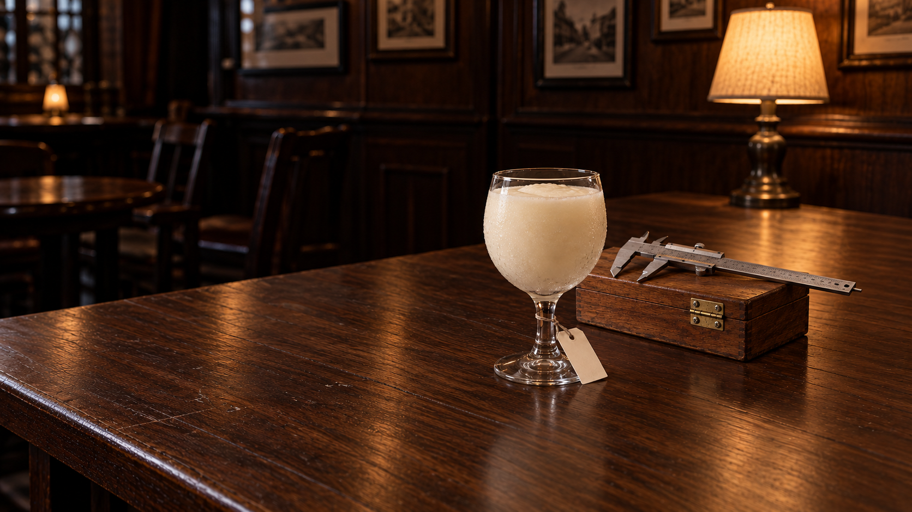
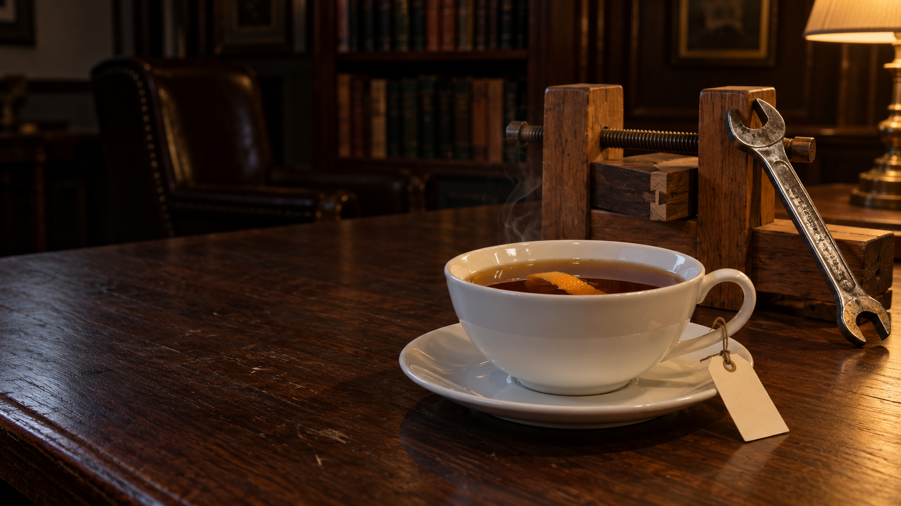
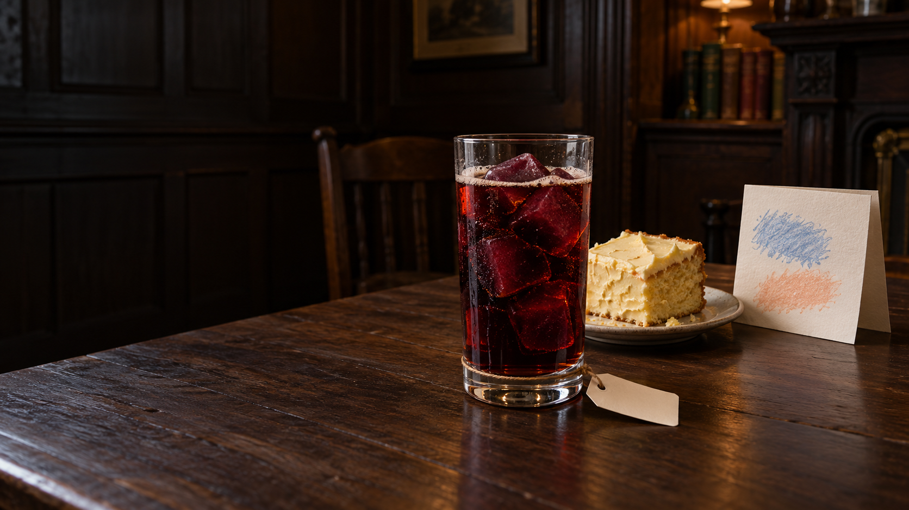
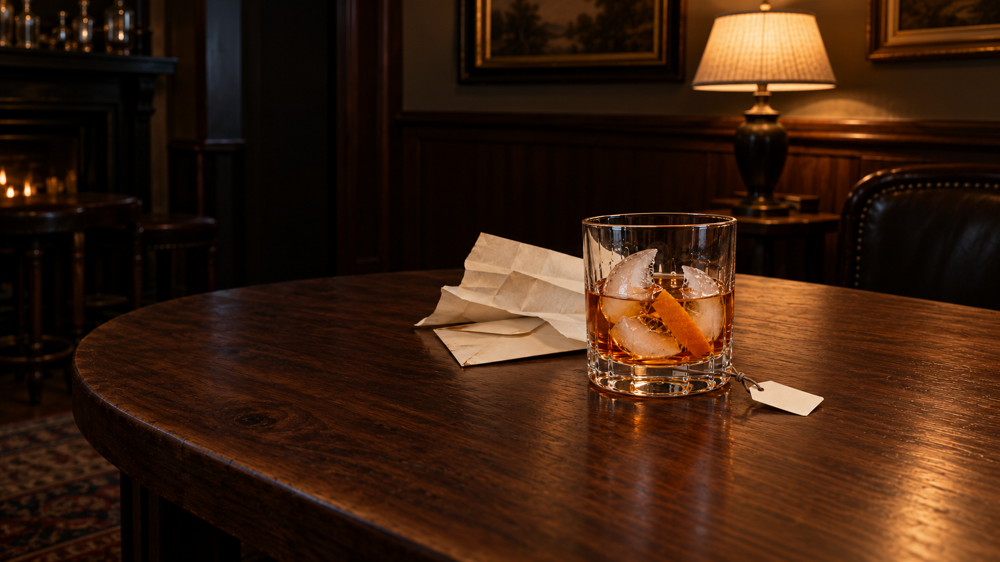
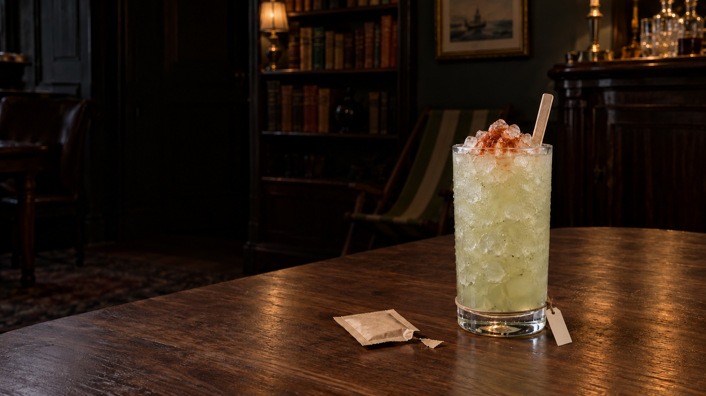
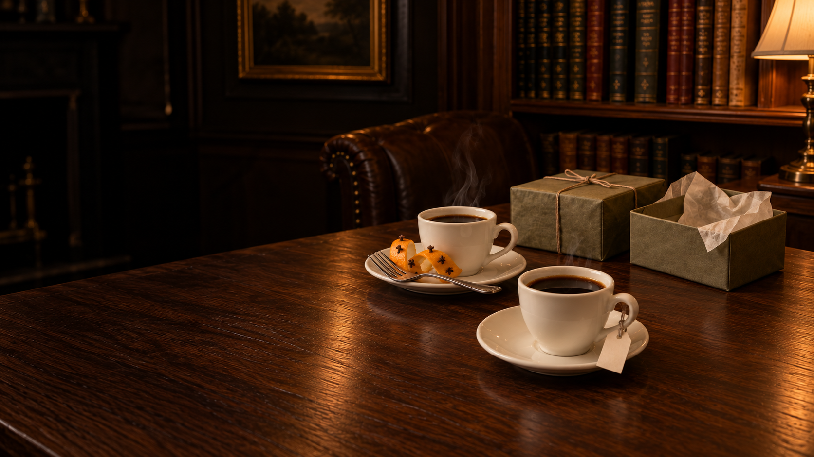
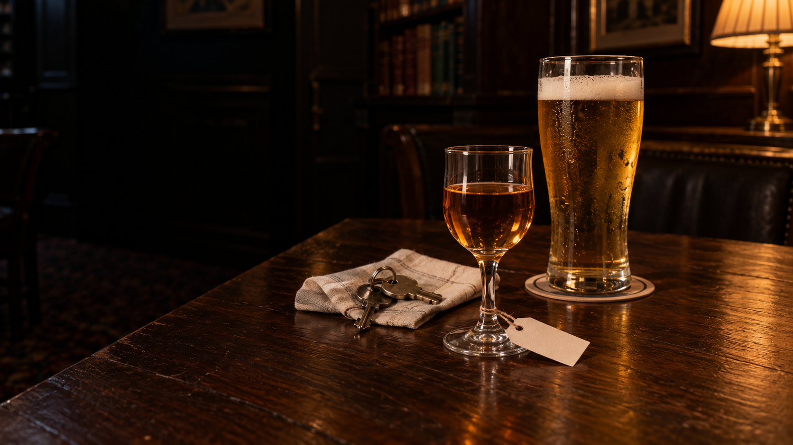
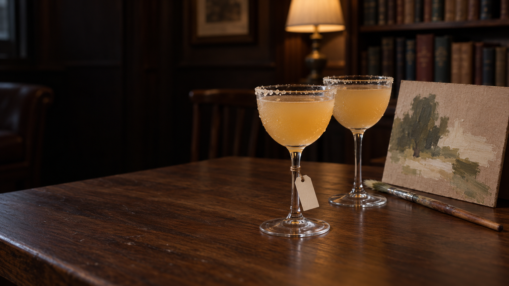
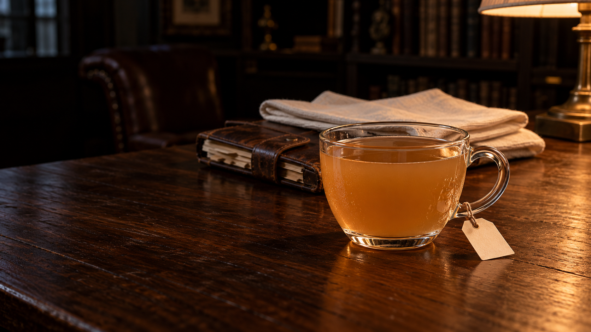
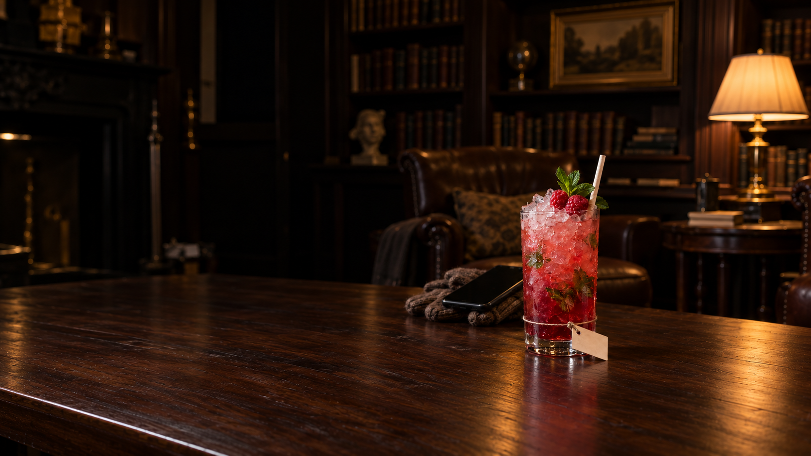

# Impeccable refinement — eleven private image pairs

7 October 2026. The last ten pours plus Who’s In?, not the full132-image catalogue. Separate portrait photographs accompany every wide. Mixed versions are intentional, explicit and preserved.

**Root reviewed all22 selected originals. These remain native PNG candidates, not final JPEGs or accepted/live images.** Recipes unchanged. Export authorization is pending; browser batch remains user-deferred. See the [full handoff and remaining holds](production-batch-14-refinement.md).

Impeccable guided quieter recent-use traces, restrained photographic materials, portrait depth-grouping and discreet supported labels. Some changes succeeded; material/cord/phone defects remain. No new version number clears those holds.

## For Good

Whole caliper is back in the wide frame. Frozen goblet retains one opaque portion. Dense glass stippling, repair-history specificity and phone grouping remain held.

[Portrait master](explorer-creator/v3/portrait-master.png) · [Wide native measurements](explorer-creator/v4/measurements.json) · [Portrait native measurements](explorer-creator/v3/measurements-portrait.json)

## Why Not?

Ordinary wood grain replaces synthetic crackle; portrait pulls small spanner beside/behind working clamp. Tools still compete with cup and phone clearance needs checking.

[Portrait master](explorer-jester/v4/portrait-master.png) · [Wide native measurements](explorer-jester/v3/wide-measurements.json) · [Portrait native measurements](explorer-jester/v4/portrait-measurements.json)

## The Way It Felt

Handmade card now has a coloured gesture; portrait layers card/cake behind the dark frozen-wine-cola drink. Recognition and live-name fit remain untested.

[Portrait master](innocent-creator/v4/portrait-master.png) · [Wide native measurements](innocent-creator/v3/measurements.json) · [Portrait native measurements](innocent-creator/v4/measurements-portrait.json)

## Unrehearsed

Pristine scroll replaced by a handled folded long sheet and envelope. Ice remains broken concave-looking shell fragments, not standard cubes. Exact shell history and paper intent remain inference.

[Portrait master](jester-explorer/v3/portrait-master.png) · [Wide native measurements](jester-explorer/v4/measurements.json) · [Portrait native measurements](jester-explorer/v3/measurements-portrait.json)

## Off the Tour

Duplicate upper cord removed; small label moved to low clear-foot transition. Chair retreats into background. Multiple close strands and hidden load remain held.

[Portrait master](jester-innocent/v4/portrait-master.png) · [Wide native measurements](jester-innocent/v4/measurements.json) · [Portrait native measurements](jester-innocent/v4/measurements-portrait.json)

## I'll Tell You Later

Two finished coffees and six mapped clove heads on the used preparation spiral retained. Both wrapped gift and open decoy now fit in wide/portrait masters. The portrait group remains too spread out for assumed tall-phone safety.

[Portrait master](jester-lover/v4/portrait-master.png) · [Wide native measurements](jester-lover/v4/wide-measurements.json) · [Portrait native measurements](jester-lover/v4/portrait-measurements.json)

## Is It Just Me

One order still uses two unmixed vessels: rye plus pilsner. Keys/linen moved nearer in portrait. Rye speckle, dense beer droplets and moving-phone margins remain held.

[Portrait master](jester-regular-guy/v3/portrait-master.png) · [Wide native measurements](jester-regular-guy/v3/wide-measurements.json) · [Portrait native measurements](jester-regular-guy/v3/portrait-measurements.json)

## In Your Own Hand

Generic palette/kit removed. Portrait bowls shortened toward small Nick-and-Noras; unfinished work moved behind them, but became oversized again and both stems acquired wraps. Wide bowl scale, artwork hierarchy, cord quietness and phone framing remain held.

[Portrait master](lover-creator/v4/portrait-master.png) · [Wide native measurements](lover-creator/v3/measurements.json) · [Portrait native measurements](lover-creator/v4/measurements-portrait.json)

## Even When You Know

Balance apparatus replaced by ordinary lens and folded spectacles; clear/tawny/red layers preserved. Portrait shows both traces whole but still spreads them sideways; patterned label and repeated high stem wrap remain held. Wide lens handle clips.

[Portrait master](magician-jester/v4/portrait-master.png) · [Wide native measurements](magician-jester/v3/measurements.json) · [Portrait native measurements](magician-jester/v4/measurements-portrait.json)

## Built to Hold

Cup glass is cleaner and both prepared linens/used organiser stack in depth. Same no-ice cold punch. Name fit, rear handle knot and final mobile reveal remain untested.

[Portrait master](magician-ruler/v4/portrait-master.png) · [Wide native measurements](magician-ruler/v3/wide-measurements.json) · [Portrait native measurements](magician-ruler/v4/portrait-measurements.json)

## Who's In?

Fresh irregular crushed ice replaces near-spherical beads; gloves/phone show the interrupted outing. Wide pulls back to retain straw. Dense wet detail, small live-name axis and moving-phone traces remain held.

[Portrait master](ruler-jester/v6/portrait-master.png) · [Wide native measurements](ruler-jester/v7/wide-measurements.json) · [Portrait native measurements](ruler-jester/v6/portrait-measurements.json)

## Review limits

Hashes verify bytes, not realism. A complete native frame or nominal portrait crop cannot prove that essential human traces survive phone cover/motion, that the actual name fits, or that a hidden knot carries load. No exporter/CLI detector/browser was executed; no public integration, queue promotion or final acceptance. The original queue remains unchanged; this is a separate private refinement branch.
